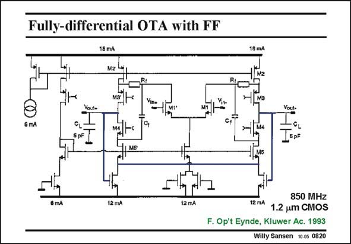

# SANSEN-0820 · Fully-differential OTA with FF

章节：08 全差分放大器  
PDF 页：242；书本页：248；幻灯片编号：0820  
状态：unreviewed



## 对应教材讲解

### PDF 242 · 书本 248

Another example of CMFB with MOSTs in the linear region is shown in this slide. It is a high-speed amplifier. A GBW of 850 MHz in two 5 pF capacitors can be reached thanks to the large currents, despite the old 1.2 mm CMOS technology. It is a folded cascode for a differential operation. The only additional feature is the feedforward around the slower pMOST cascodes through capacitors C . f The CMFB amplifier is the same as before. The outputs are around 0 V, because the Gates of the nMOSTs providing DC current to the input pair are at zero ground.

## 公式／性能结论候选摘录

以下为规则截取的原文，尚未逐项判读。

（未由规则找到；不代表原页没有此类内容。）

## 曲线结论候选摘录

以下为规则截取的原文，尚未逐项判读。

（未由规则找到；不代表原页没有此类内容。）

## 原文条件与近似候选摘录

以下为规则截取的原文，尚未逐项判读。

（未由规则找到；不代表原页没有此类内容。）

## 幻灯片 OCR（未校正）

```text
Fully-differential OTA with FF
18 m4
Mz
18 m4
м3
& mA
MS
12 mA
12 mA|
850 MHZ
12 mA 1.2 um CMOS
F. Op't Eynde, Kluwer Ac. 1993
Willy Sansen 10-0s 0820
```

数学上下标、分数及正负号以原图为准。电路图已保留；未核对的连接不输出成可仿真 netlist。
