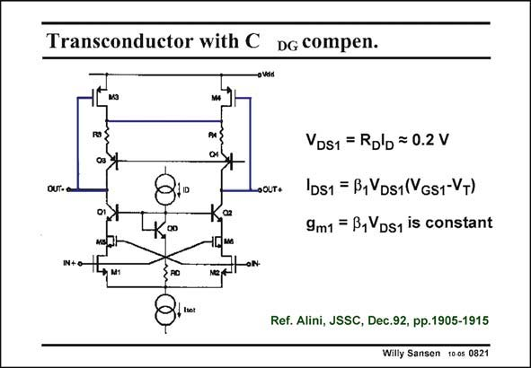

# SANSEN-0821 · Transconductor with C DG compen.

章节：08 全差分放大器  
PDF 页：243；书本页：249；幻灯片编号：0821  
状态：unreviewed



## 对应教材讲解

### PDF 243 · 书本 249

As a last example of this type of common-mode feedback, a simple single-stage voltage amplifier is repeated in this slide. It is however, a transconductor for differential operation. The input devices operate in the linear region to avoid distortion. The CMFB amplifier also consists of devices in the linear region, in order to provide accurate cancellation of the differential signal. The loop is closed over pnp transistors with some Emitter degeneration. This CMFB amplifier has one disadvantage however, which is also present for the very first single-stage voltage amplifier discussed on slide 16 of this Chapter. The average output voltage is not so well defined. The average or common-mode output voltage is set by the V values of the top transistors GS M3 and M4. These values will depend on the currents imposed by current source I , the sizes tot of transistors M3/M4 and their KP values. They are therefore not that accurate. Whether this is a problem depends on the next circuit, which inherits its DC biasing from this stage.

## 公式／性能结论候选摘录

以下为规则截取的原文，尚未逐项判读。

- PDF 243: These values will depend on the currents imposed by current source I , the sizes tot of transistors M3/M4 and their KP values.
- PDF 243: They are therefore not that accurate.
- PDF 243: Whether this is a problem depends on the next circuit, which inherits its DC biasing from this stage.

## 曲线结论候选摘录

以下为规则截取的原文，尚未逐项判读。

（未由规则找到；不代表原页没有此类内容。）

## 原文条件与近似候选摘录

以下为规则截取的原文，尚未逐项判读。

（未由规则找到；不代表原页没有此类内容。）

## 幻灯片 OCR（未校正）

```text
Transconductor with C DG compen.
R3
VDS1 = Rolb = 0.2 V
OUT-o
•OLT+
02
0o
IDs1 = B1VDs1(VGs1-VT)
9m1 = B, VDs1 is constant
IN+O-
M1
Ref. Alini, JSSC, Dec.92, pp.1905-1915
Willy Sansen 10 os 0821
```

数学上下标、分数及正负号以原图为准。电路图已保留；未核对的连接不输出成可仿真 netlist。
