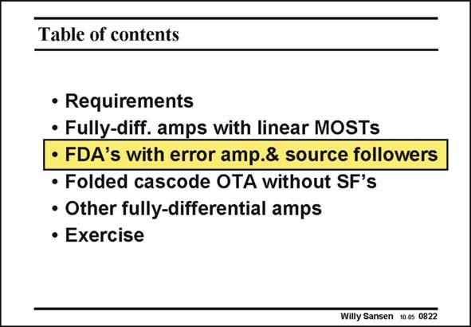

# SANSEN-0822 · Table of contents

章节：08 全差分放大器  
PDF 页：243；书本页：249；幻灯片编号：0822  
状态：unreviewed



## 对应教材讲解

### PDF 243 · 书本 249

The main advantage of this first principle of CMFB is that no additional power is required. The main disadvantage is that this CMFB amplifier may not be sufficiently fast, depending on the application. This second principle has exactly the opposite characteristics. It takes two more stages, resulting in much more power consumption. The speed however, can be set independently of the differential amplifier, and can be made as large as the designer likes.

## 公式／性能结论候选摘录

以下为规则截取的原文，尚未逐项判读。

- PDF 243: The main disadvantage is that this CMFB amplifier may not be sufficiently fast, depending on the application.

## 曲线结论候选摘录

以下为规则截取的原文，尚未逐项判读。

- PDF 243: This second principle has exactly the opposite characteristics.

## 原文条件与近似候选摘录

以下为规则截取的原文，尚未逐项判读。

（未由规则找到；不代表原页没有此类内容。）

## 幻灯片 OCR（未校正）

```text
Table of contents
• Requirements
• Fully-diff. amps with linear MOSTs
• FDA's with error amp.& source followers
• Folded cascode OTA without SF's
• Other fully-differential amps
• Exercise
Willy Sansen 10-0s 0822
```

数学上下标、分数及正负号以原图为准。电路图已保留；未核对的连接不输出成可仿真 netlist。
