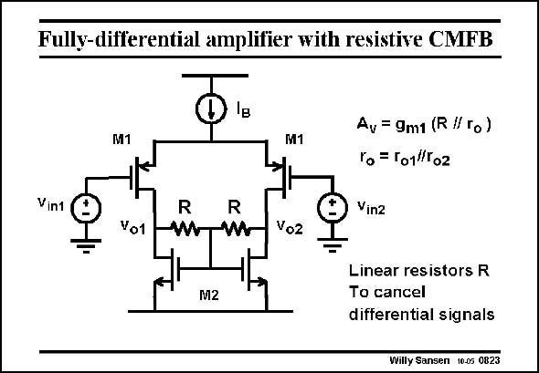

# SANSEN-0823 · Fully-differential amplifier with resistive CMFB

章节：08 全差分放大器  
PDF 页：244；书本页：250；幻灯片编号：0823  
状态：unreviewed



## 对应教材讲解

### PDF 244 · 书本 250

This fully-differential amplifier uses two equal resistors R to cancel out the differential signals. In this way a common-mode biasing voltage is obtained for the Gates of transistors M2. Consequently, there is no biasing problem. Current source I determines all B currents. The main disadvantage is that the resistors R must be increased in size to ensure a lot of gain. An easy solution is to insert source followers between the Drains of the input transistors M1 and the two resistors R, as shown next. Smaller values of R are then possible.

## 公式／性能结论候选摘录

以下为规则截取的原文，尚未逐项判读。

- PDF 244: This fully-differential amplifier uses two equal resistors R to cancel out the differential signals.
- PDF 244: The main disadvantage is that the resistors R must be increased in size to ensure a lot of gain.

## 曲线结论候选摘录

以下为规则截取的原文，尚未逐项判读。

（未由规则找到；不代表原页没有此类内容。）

## 原文条件与近似候选摘录

以下为规则截取的原文，尚未逐项判读。

（未由规则找到；不代表原页没有此类内容。）

## 幻灯片 OCR（未校正）

```text
Fully-differential amplifier with resistive CMFB
M1
M1
Vint
R
Vo1
Av = 9m1 (R // To)
Гo = 101//T02
Vin2
Vo2
M2
Linear resistors R
To cancel
differential signals
Willy Sansen 10.05 0823
```

数学上下标、分数及正负号以原图为准。电路图已保留；未核对的连接不输出成可仿真 netlist。
