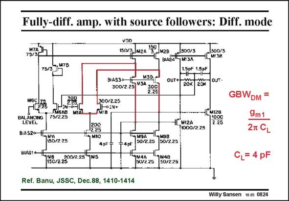

# SANSEN-0824 · Fully-diff. amp. with source followers: Diff. mode

章节：08 全差分放大器  
PDF 页：244；书本页：250；幻灯片编号：0824  
状态：unreviewed



## 对应教材讲解

### PDF 244 · 书本 250

The circuit schematic is shown in this slide. The differential amplifier is just a folded cascode OTA, loaded with 4 pF capacitors. Its GBW is then readily DM obtained. Two more source followers are added at the outputs, which are required for the CMFB, but which can be used as outputs for differential operation as well.

## 公式／性能结论候选摘录

以下为规则截取的原文，尚未逐项判读。

（未由规则找到；不代表原页没有此类内容。）

## 曲线结论候选摘录

以下为规则截取的原文，尚未逐项判读。

（未由规则找到；不代表原页没有此类内容。）

## 原文条件与近似候选摘录

以下为规则截取的原文，尚未逐项判读。

（未由规则找到；不代表原页没有此类内容。）

## 幻灯片 OCR（未校正）

```text
Fully-diff. amp. with source followers: Diff. mode
M7A
75/3
VOD
150/3. N24150
LM2B
300/3
[MIзe
-, M7B
75/3
MEC/Z5
HIN-O"
ПиБлЕ
MiAL
75/2.25
BALANCING
LEVEL
BIAS2O 1E,vw
150/2.25
SIST 98
150/22200/2.25
BIAS3O
M391
300/225 "3A 20g)
300/2.25
1M18
200
2.25
* MIO
4pF:
Lpt 15pF
OUT+ ZOk 20й ouT-
1ГMZА
T1000/2.25
1[м128
11000
2.25
M9A
50/2.25
50/2 25
4pF
19s44
1H48
50/2.25
50/225
GBWDM =
9m1
27 CL
L= 4 pF
Ref. Banu, JSSC, Dec.88, 1410-1414
Willy Sansen 10.05 0824
```

数学上下标、分数及正负号以原图为准。电路图已保留；未核对的连接不输出成可仿真 netlist。
