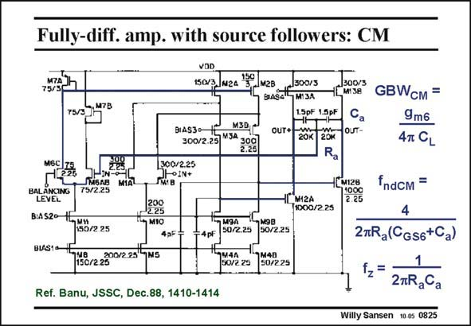

# SANSEN-0825 · Fully-diff. amp. with source followers: CM

章节：08 全差分放大器  
PDF 页：245；书本页：251；幻灯片编号：0825  
状态：unreviewed



## 对应教材讲解

### PDF 245 · 书本 251

The CMFB amplifier is highlighted on this slide. It takes two more stages to realize this feedback loop. The first one consists of two source followers to provide low-impedance outputs. They are needed to be able to connect two resistors R to the outputs, to provide a accurate cancellation of the differential signals. The other stage on the left, is the error amplifier. It compares the average output voltage to a reference voltage, and feeds back to the biasing of the cascode stage. It is clear that a lot of power is required to bias these two extra stages. Minimization of the power consumption is of the utmost importance. The GBW is easily obtained, as transistors M6 are the input devices. The source followers CM only have a gain of unity. A factor of two is lost because only one output is taken of the error amplifier. Since the GBW is set independently of the differential input, it can be set at any CM value larger than the GBW . DM Obviously, we are very worried about the stability of this multistage CMFB amplifier. The nodes with non-dominant poles are the outputs, the Gate of M6AB and the Gates of current mirror M2/M7.The most important one is probably at the Gate of M6AB, depending on the choice of R . At this node the resistors R are in parallel, and the input capacitances C in a a GS6 series, which gives twice a factor of two in the f . A zero f is introduced with C to compensate ndCM z a this f . ndCM

## 公式／性能结论候选摘录

以下为规则截取的原文，尚未逐项判读。

- PDF 245: The source followers CM only have a gain of unity.
- PDF 245: The nodes with non-dominant poles are the outputs, the Gate of M6AB and the Gates of current mirror M2/M7.The most important one is probably at the Gate of M6AB, depending on the choice of R .

## 曲线结论候选摘录

以下为规则截取的原文，尚未逐项判读。

（未由规则找到；不代表原页没有此类内容。）

## 原文条件与近似候选摘录

以下为规则截取的原文，尚未逐项判读。

（未由规则找到；不代表原页没有此类内容。）

## 幻灯片 OCR（未校正）

```text
Fully-diff. amp. with source followers: CM
75/30
,M7B
75/3
H6С 75
225
ЛМБАН
HIN-O-
MIAL
75/2.25
BALANCING
LEVEL
31520-1Lus
50/2 25
BIAS10
BIAS30-
M3D
300/2.25 V3A 100)
2.25|
1300/2.25
OIN+
200
2.25
* MIO
4pF
200/225 9MS
150/226
150/3 м2a 30.
_M2B
1300/3
1[ мIзв
15pF 1.3pF
Ca
OUT+
ZOR 20N
OT-
Ra
1[м2A
800./2.25
1(м128
71000
2.25
M9A
50/225
K9B
50/2.25
=4pF
169u41
50/2.29
"1M4B
50/225
GBWсM =
9m6
4T CL
Ref. Banu, JSSC, Dec.88, 1410-1414
fndсм =
4
2mRa(CGs6+Ca)
1
2mRaCa
Willy Sansen 10.0s 0825
```

数学上下标、分数及正负号以原图为准。电路图已保留；未核对的连接不输出成可仿真 netlist。
