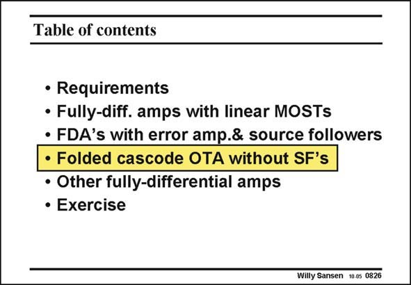

# SANSEN-0826 · Table of contents

章节：08 全差分放大器  
PDF 页：245；书本页：251；幻灯片编号：0826  
状态：unreviewed



## 对应教材讲解

### PDF 245 · 书本 251

The source followers in the previous realization take a lot of power. This is why they are left out in this third type of CMFB. This one will take less power. However, some other disadvantage will show up. The output swing will be limited by the CMFB amplifier, not by the differential one!

## 公式／性能结论候选摘录

以下为规则截取的原文，尚未逐项判读。

- PDF 245: The output swing will be limited by the CMFB amplifier, not by the differential one!

## 曲线结论候选摘录

以下为规则截取的原文，尚未逐项判读。

（未由规则找到；不代表原页没有此类内容。）

## 原文条件与近似候选摘录

以下为规则截取的原文，尚未逐项判读。

（未由规则找到；不代表原页没有此类内容。）

## 幻灯片 OCR（未校正）

```text
Table of contents
• Requirements
• Fully-diff. amps with linear MOSTs
• FDA's with error amp.& source followers
• Folded cascode OTA without SF's
• Other fully-differential amps
• Exercise
Willy Sansen 10 05 0826
```

数学上下标、分数及正负号以原图为准。电路图已保留；未核对的连接不输出成可仿真 netlist。
