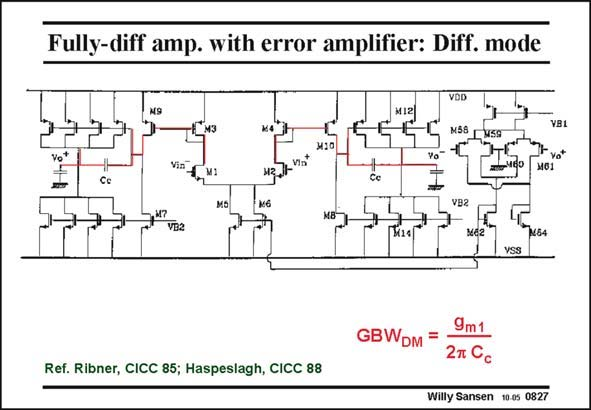

# SANSEN-0827 · Fully-diff amp. with error amplifier: Diff. mode

章节：08 全差分放大器  
PDF 页：246；书本页：252；幻灯片编号：0827  
状态：unreviewed



## 对应教材讲解

### PDF 246 · 书本 252

The error amplifier for the CMFB is now on the right. The differential amplifier is just a conventional twostage Miller amplifier with a symmetrical amplifier as an input stage. The GBW is therefore DM easily obtained. The biasing of the input pair is provided by the CMFB as shown next.

## 公式／性能结论候选摘录

以下为规则截取的原文，尚未逐项判读。

- PDF 246: The GBW is therefore DM easily obtained.

## 曲线结论候选摘录

以下为规则截取的原文，尚未逐项判读。

（未由规则找到；不代表原页没有此类内容。）

## 原文条件与近似候选摘录

以下为规则截取的原文，尚未逐项判读。

- PDF 246: The biasing of the input pair is provided by the CMFB as shown next.

## 幻灯片 OCR（未校正）

```text
Fully-diff amp. with error amplifier: Diff. mode
VDD
M61
Ref. Ribner, CICC 85; Haspeslagh, CICC 88
9m1
GBWDm =
2п Cс
Willy Sansen 10.05 0827
```

数学上下标、分数及正负号以原图为准。电路图已保留；未核对的连接不输出成可仿真 netlist。
