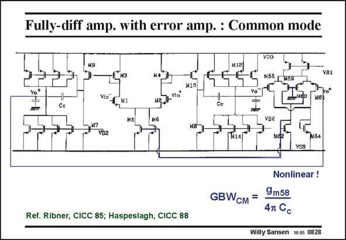

# SANSEN-0828 · Fully-diff amp. with error amp. : Common mode

章节：08 全差分放大器  
PDF 页：246；书本页：252；幻灯片编号：0828  
状态：unreviewed



## 对应教材讲解

### PDF 246 · 书本 252

The error amplifier consists of two differential pairs M58–61, each of them being connected to an output of the differential amplifier. They compare the outputs directly to ground, which is obviously halfway the supply voltages. The average output voltage is well defined. The cancellation of the differential signals is now carried out at the outputs of these two differential pairs and fed back to the current source M5/M6 of the input pair. The GBW is thus determined by the common-mode pairs M58–61, as given in this slide. CM Again a factor of two is lost because only one output is taken of these pairs. It can be set at any value though, higher than the GBW if required. CM The main advantage of this CMFB configuration is that it takes less power and yet provides a wide-band CMFB amplifier. However, the only non-dominant pole added is at the gates of M5/M6. The main disadvantage of this solution is that the output swing is limited by the commonmode input range of the CMFB amplifier. The differential pair M58/M59 limits the range to about 2.8(V −V ). The output swing of the differential amplifier is rail-to-rail. GS T

## 公式／性能结论候选摘录

以下为规则截取的原文，尚未逐项判读。

- PDF 246: The GBW is thus determined by the common-mode pairs M58–61, as given in this slide.
- PDF 246: The main disadvantage of this solution is that the output swing is limited by the commonmode input range of the CMFB amplifier.
- PDF 246: The differential pair M58/M59 limits the range to about 2.8(V −V ).

## 曲线结论候选摘录

以下为规则截取的原文，尚未逐项判读。

（未由规则找到；不代表原页没有此类内容。）

## 原文条件与近似候选摘录

以下为规则截取的原文，尚未逐项判读。

（未由规则找到；不代表原页没有此类内容。）

## 幻灯片 OCR（未校正）

```text
Fully-diff amp. with error amp. : Common mode
VDD
М58 Г
GBWсm =
Ref. Ribner, CICC 85; Haspeslagh, CICC 88
Nonlinear !
9m58
47 Cc
Willy Sansen 10.0s 0828
```

数学上下标、分数及正负号以原图为准。电路图已保留；未核对的连接不输出成可仿真 netlist。
