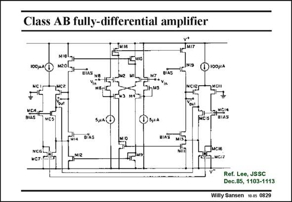

# SANSEN-0829 · Class AB fully-differential amplifier

章节：08 全差分放大器  
PDF 页：247；书本页：253；幻灯片编号：0829  
状态：unreviewed



## 对应教材讲解

### PDF 247 · 书本 253

An example of such common-mode feedback is the amplifier shown in this slide. The input stage consists of class AB differential pairs and will be discussed in Chapter 12. Their outputs are current mirrored (M15/ M18, M10/M11, M16/M17, M9/M12) to the outputs over cascode transistors. It is thus a symmetrical OTA for a differential operation. The common-feedback amplifier consists of two differential pairs on either side. Two connections are used to cancel the differential signal. The outputs are then fed back to the sources of cascodes M13 and M14 to the outputs. It is clear that a lot of current is consumed in the CMFB amplifiers. Moreover, the output swings are limited by input ranges of the CMFB differential pairs, as explained in this slide.

## 公式／性能结论候选摘录

以下为规则截取的原文，尚未逐项判读。

- PDF 247: It is thus a symmetrical OTA for a differential operation.
- PDF 247: Moreover, the output swings are limited by input ranges of the CMFB differential pairs, as explained in this slide.

## 曲线结论候选摘录

以下为规则截取的原文，尚未逐项判读。

（未由规则找到；不代表原页没有此类内容。）

## 原文条件与近似候选摘录

以下为规则截取的原文，尚未逐项判读。

（未由规则找到；不代表原页没有此类内容。）

## 幻灯片 OCR（未校正）

```text
Class AB fully-differential amplifier
100 MA(
MIgl
M20l
NIS
NC!
мCA.
BIAS
MCIS
g, ИCI®
BIAS
BIAS
MIS
MGI7
МСТ-
Ref. Lee, JSSC
Dec.85, 1103-1113
Willy Sansen 10-0s 0829
```

数学上下标、分数及正负号以原图为准。电路图已保留；未核对的连接不输出成可仿真 netlist。
