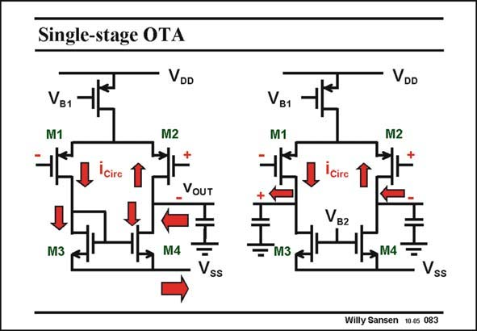

# SANSEN-083 · Single-stage OTA

章节：08 全差分放大器  
PDF 页：234；书本页：240；幻灯片编号：083  
状态：unreviewed



## 对应教材讲解

### PDF 234 · 书本 240

The simplest fully-differential amplifier is certainly this single-stage OTA, shown on the right. It is very similar to the differential voltage amplifier discussed in Chapter 2, shown on the left. However, the current mirror is substituted by two DC current sources. The circular current, generated by the differential input voltage is indicated with arrows. It is clear that this fullydifferential OTA is even simpler than the single-ended voltage amplifier. Only two transistors participate in the small-signal operation. It can therefore reach higher frequencies! On the other hand, it is also clear that this amplifier has a biasing problem. Both biasing voltages V and V try to set the DC currents, which is one too many! B1 B2

## 公式／性能结论候选摘录

以下为规则截取的原文，尚未逐项判读。

- PDF 234: It can therefore reach higher frequencies!

## 曲线结论候选摘录

以下为规则截取的原文，尚未逐项判读。

（未由规则找到；不代表原页没有此类内容。）

## 原文条件与近似候选摘录

以下为规则截取的原文，尚未逐项判读。

（未由规则找到；不代表原页没有此类内容。）

## 幻灯片 OCR（未校正）

```text
Single-stage OTA
VDD
Vв1
M1
M2
ICirc
VOUT
M3
M4
Vss
VB1
M1
M3
VDD
M2
iciro
M4
Vss
Willy Sansen 10.05 083
```

数学上下标、分数及正负号以原图为准。电路图已保留；未核对的连接不输出成可仿真 netlist。
