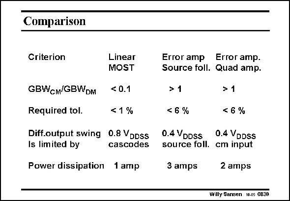

# SANSEN-0830 · Comparison

章节：08 全差分放大器  
PDF 页：247；书本页：253；幻灯片编号：0830  
状态：unreviewed



## 对应教材讲解

### PDF 247 · 书本 253

As a comparison, the three types of CMFB amplifiers are listed in this slide. It is clear that the first type, with the MOSTs in the linear region, has the lowest power consumption. It does not offer the same wideband performance of the other two. It only uses one single amplifier. Its output swing is limited by the use of cascodes. It can still be about 80% of the total supply voltage, which is not too bad at all. The third type of CMFB amplifier needs one amplifier more, i.e. the error amplifier. Its speed is good but its output swing is limited by the input common-mode range. In addition, the middle CMFB amplifier needs source followers. It now requires three amplifier stages which takes a lot of power. Its output swing is now mainly limited by the source followers. Indeed their V values have to be subtracted directly from the output swings. GS Adding more differential pairs in the CMFB pairs makes the requirements on the matching more severe. The first solution with transistors in the linear region require stiffer tolerances than the other ones. It would take an elaborate analysis to show this, which, however, is left out.

## 公式／性能结论候选摘录

以下为规则截取的原文，尚未逐项判读。

- PDF 247: Its output swing is limited by the use of cascodes.
- PDF 247: Its speed is good but its output swing is limited by the input common-mode range.
- PDF 247: Its output swing is now mainly limited by the source followers.

## 曲线结论候选摘录

以下为规则截取的原文，尚未逐项判读。

（未由规则找到；不代表原页没有此类内容。）

## 原文条件与近似候选摘录

以下为规则截取的原文，尚未逐项判读。

（未由规则找到；不代表原页没有此类内容。）

## 幻灯片 OCR（未校正）

```text
Comparison
Criterion
GBWcM/GBWDM
Required tol.
Linear
MOST
< 0.1
< 1%
Diff.output swing 0.8 VDDSs
Is limited by
cascodes
Power dissipation 1 amp
Error amp Error amp.
Source foll. Quad amp.
>1
> 1
< 6 %
< 6 %
0.4 VDDSS
0.4 VDDSS
source foll. cm input
3 amps
2 amps
Willy Sansen 10.05 0830
```

数学上下标、分数及正负号以原图为准。电路图已保留；未核对的连接不输出成可仿真 netlist。
