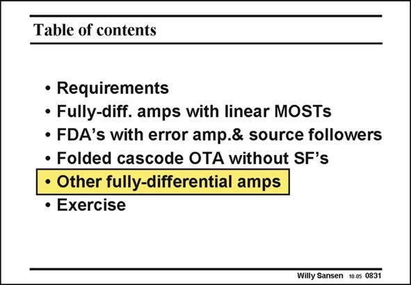

# SANSEN-0831 · Table of contents

章节：08 全差分放大器  
PDF 页：248；书本页：254；幻灯片编号：0831  
状态：unreviewed



## 对应教材讲解

### PDF 248 · 书本 254

Most fully-differential amplifiers use one of the three types of CMFB shown in this slide. They may also use some variations on these configurations, as shown next. Also some switching solutions are available, which are used in sampled-data systems.

## 公式／性能结论候选摘录

以下为规则截取的原文，尚未逐项判读。

（未由规则找到；不代表原页没有此类内容。）

## 曲线结论候选摘录

以下为规则截取的原文，尚未逐项判读。

（未由规则找到；不代表原页没有此类内容。）

## 原文条件与近似候选摘录

以下为规则截取的原文，尚未逐项判读。

（未由规则找到；不代表原页没有此类内容。）

## 幻灯片 OCR（未校正）

```text
Table of contents
• Requirements
• Fully-diff. amps with linear MOSTs
• FDA's with error amp.& source followers
• Folded cascode OTA without SF's
• Other fully-differential amps
• Exercise
Willy Sansen 10 0s 0831
```

数学上下标、分数及正负号以原图为准。电路图已保留；未核对的连接不输出成可仿真 netlist。
