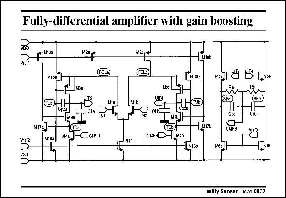

# SANSEN-0832 · Fully-ditferential amplitier with gain boosting

章节：08 全差分放大器  
PDF 页：248；书本页：254；幻灯片编号：0832  
状态：unreviewed



## 对应教材讲解

### PDF 248 · 书本 254

The first example is shown in this slide. It consists of a folded-cascode OTA for differential operation. Gain boosting is added to all cascodes. Its GBW is of the order of DM hundreds of MHz, and yet its gain can be as high as 100 dB. The CMFB amplifier starts with source followers. It is therefore of type two. However, no error amplifier is used to reduce the power consumption. The extra gain of the error amplifier is not required as the common-mode feedback is applied to the Gates of transistors M4, which have gain-boosted cascodes to the outputs as well. The common-mode loop gain is sufficiently high indeed.

## 公式／性能结论候选摘录

以下为规则截取的原文，尚未逐项判读。

- PDF 248: Gain boosting is added to all cascodes.
- PDF 248: Its GBW is of the order of DM hundreds of MHz, and yet its gain can be as high as 100 dB.
- PDF 248: It is therefore of type two.
- PDF 248: The extra gain of the error amplifier is not required as the common-mode feedback is applied to the Gates of transistors M4, which have gain-boosted cascodes to the outputs as well.
- PDF 248: The common-mode loop gain is sufficiently high indeed.

## 曲线结论候选摘录

以下为规则截取的原文，尚未逐项判读。

（未由规则找到；不代表原页没有此类内容。）

## 原文条件与近似候选摘录

以下为规则截取的原文，尚未逐项判读。

（未由规则找到；不代表原页没有此类内容。）

## 幻灯片 OCR（未校正）

```text
Fully-ditferential amplitier with gain boosting
+418a
M2a,
M13b
Misa]
M'Eh
NESJ|
MSa
M17a.
1491
M4a
v.or2
М11ба
-OCMFD
CHFAR
N4b
M11
-1м170
142162
N6a
Willy Sansen 10.05 0832
```

数学上下标、分数及正负号以原图为准。电路图已保留；未核对的连接不输出成可仿真 netlist。
