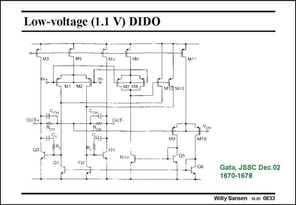

# SANSEN-0833 · Low-voltage (1.1 V) DIDO

章节：08 全差分放大器  
PDF 页：249；书本页：255；幻灯片编号：0833  
状态：unreviewed



## 对应教材讲解

### PDF 249 · 书本 255

Another good example of a fully-differential amplifier of type 2 is shown in this slide. Two-stage Miller opamps are used now. This gives the additional advantage that the output impedance is not so high at middle frequencies. The source followers can now be left out. Only an error amplifier is required.

## 公式／性能结论候选摘录

以下为规则截取的原文，尚未逐项判读。

（未由规则找到；不代表原页没有此类内容。）

## 曲线结论候选摘录

以下为规则截取的原文，尚未逐项判读。

（未由规则找到；不代表原页没有此类内容。）

## 原文条件与近似候选摘录

以下为规则截取的原文，尚未逐项判读。

（未由规则找到；不代表原页没有此类内容。）

## 幻灯片 OCR（未校正）

```text
Low-voltage (1.1 V) DIDO
Mt
M2
M12 M13
©сы
ССМІН!
OUT+
OUT-
M10
Gata, JSSC Dec.02
1670-1678
Willy Sansen 10.0s 0833
```

数学上下标、分数及正负号以原图为准。电路图已保留；未核对的连接不输出成可仿真 netlist。
