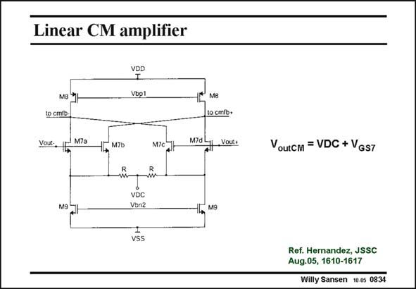

# SANSEN-0834 · Linear CM amplifier

章节：08 全差分放大器  
PDF 页：249；书本页：255；幻灯片编号：0834  
状态：unreviewed



## 对应教材讲解

### PDF 249 · 书本 255

An example of the CMFB amplifier of type 3 is shown in this slide. The main disadvantage of such a CMFB amplifier is that its input range is too limited. This input range can be enhanced by addition of Source resistors R as shown in this slide. The linearity is therefore greatly improved. Note, the average output voltage is the sum of the reference voltage VDC and V . GS7 Also, the transistors M7 are split up in equal parts. All four DC currents through transistors M7 are equal. The cancellation of the differential signal is now carried out by cross-coupling. An additional advantage of the insertion of the resistors R is that the input capacitance loading offered to the differential amplifier is minimal. In this way, high-frequency, fully-differential opamps can be obtained.

## 公式／性能结论候选摘录

以下为规则截取的原文，尚未逐项判读。

- PDF 249: The main disadvantage of such a CMFB amplifier is that its input range is too limited.
- PDF 249: The linearity is therefore greatly improved.
- PDF 249: GS7 Also, the transistors M7 are split up in equal parts.
- PDF 249: All four DC currents through transistors M7 are equal.

## 曲线结论候选摘录

以下为规则截取的原文，尚未逐项判读。

（未由规则找到；不代表原页没有此类内容。）

## 原文条件与近似候选摘录

以下为规则截取的原文，尚未逐项判读。

（未由规则找到；不代表原页没有此类内容。）

## 幻灯片 OCR（未校正）

```text
Linear CM amplifier
VDD
Vbp1
to cmib.
Vour: 15
M7a
M7b
-т-
MIC H
12 M8
to cmib+
Md Voc:
VDC
Von2
НГ. м9
vSS
Voutcm = VDC + VGs7
Rus. bsrmander, 55cc
Willy Sansen 10.05 0834
```

数学上下标、分数及正负号以原图为准。电路图已保留；未核对的连接不输出成可仿真 netlist。
