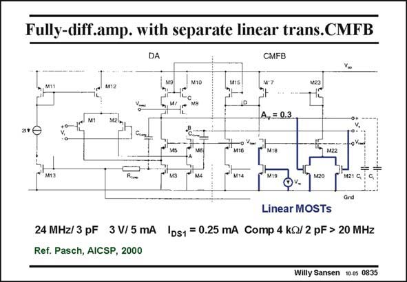

# SANSEN-0835 · Fully-diff.amp. with separate linear trans.CMFB

章节：08 全差分放大器  
PDF 页：250；书本页：256；幻灯片编号：0835  
状态：unreviewed



## 对应教材讲解

### PDF 250 · 书本 256

This fully-differential amplifier uses a CMFB of type one, i.e. with transistors in the linear region (on the right). The differential amplifier is just a folded cascode OTA. Additional capacitances C with R are comp comp used to boost its high-frequency performance (above 20 MHz). The CMFB amplifier consists of MOSTs M20/ M21 in the linear region and current mirrors M23/M17 and M15/M9,10. This is a wide-band amplifier, but at the cost of additional power consumption. The outputs will end up around reference voltage V , as the transistors M19–21 have sizes ref which are matched to their currents.

## 公式／性能结论候选摘录

以下为规则截取的原文，尚未逐项判读。

（未由规则找到；不代表原页没有此类内容。）

## 曲线结论候选摘录

以下为规则截取的原文，尚未逐项判读。

（未由规则找到；不代表原页没有此类内容。）

## 原文条件与近似候选摘录

以下为规则截取的原文，尚未逐项判读。

（未由规则找到；不代表原页没有此类内容。）

## 幻灯片 OCR（未校正）

```text
Fully-diff.amp. with separate linear trans.CMFB
DA
CMFB
A, = 0.3
M18
oV.mi
M13
M20
M21 C, G
Gnd
Linear MOSTs
24 MHz/3 pF 3V/5 mA |ds1 = 0.25 mA Comp 4 kQ/ 2 pF > 20 MHz
Ref. Pasch, AICSP, 2000
Willy Sansen 10-0 0835
```

数学上下标、分数及正负号以原图为准。电路图已保留；未核对的连接不输出成可仿真 netlist。
