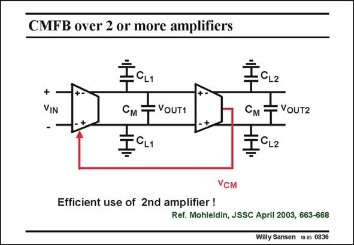

# SANSEN-0836 · CMFB over 2 or more amplifiers

章节：08 全差分放大器  
PDF 页：250；书本页：256；幻灯片编号：0836  
状态：unreviewed



## 对应教材讲解

### PDF 250 · 书本 256

When several fullydifferential amplifiers are used in series, for high-order filters for example, there is no need to have CMFB around each stage separately. In order to save power, CMFB can be applied over two differential amplifiers in series, as shown in this slide. Now, the average output voltage is measured at the output of the second amplifier, and applied to the common-mode input of the first amplifier. Since the common-mode output of the first amplifier is used to set the biasing of the second one, all common-mode levels are well defined.

## 公式／性能结论候选摘录

以下为规则截取的原文，尚未逐项判读。

（未由规则找到；不代表原页没有此类内容。）

## 曲线结论候选摘录

以下为规则截取的原文，尚未逐项判读。

（未由规则找到；不代表原页没有此类内容。）

## 原文条件与近似候选摘录

以下为规则截取的原文，尚未逐项判读。

（未由规则找到；不代表原页没有此类内容。）

## 幻灯片 OCR（未校正）

```text
CMFB over 2 or more amplifiers
+
VIN
IH
: CL1
См
VOUT1
T
Cм -
VOUT2
VсM
Efficient use of 2nd amplifier !
Ref. Mohieldin, JSSC April 2003, 663-668
Willy Sansen 10-0s 0836
```

数学上下标、分数及正负号以原图为准。电路图已保留；未核对的连接不输出成可仿真 netlist。
