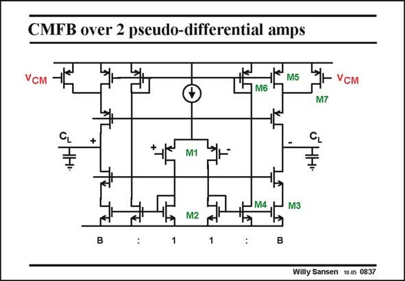

# SANSEN-0837 · CMFB over 2 pseudo-differential amps

章节：08 全差分放大器  
PDF 页：251；书本页：257；幻灯片编号：0837  
状态：unreviewed



## 对应教材讲解

### PDF 251 · 书本 257

Common-mode feedback can also be embedded in the differential amplifier as shown in this slide. After all, this is a symmetrical OTA with current factor B. However, the current mirrors M2/M3 have an additional output current with transistors M4, to cancel the differential signals at the diode-connected MOSTs M6. These latter devices are the inputs of current mirrors M5/M6 which close the feedback loop. The actual output voltages can be modified by injecting currents with transistors M7 driven by some other CMFB loop. The additional power consumption in this solution, is quite modest. Moreover, the output swing is not hampered by the CMFB amplifier. As a consequence, this is an attractive solution indeed!

## 公式／性能结论候选摘录

以下为规则截取的原文，尚未逐项判读。

（未由规则找到；不代表原页没有此类内容。）

## 曲线结论候选摘录

以下为规则截取的原文，尚未逐项判读。

（未由规则找到；不代表原页没有此类内容。）

## 原文条件与近似候选摘录

以下为规则截取的原文，尚未逐项判读。

（未由规则找到；不代表原页没有此类内容。）

## 幻灯片 OCR（未校正）

```text
CMFB over 2 pseudo-differential amps
M5
VсM
M6
M7
CL
+
CL
M1
M4
M2
M3
Willy Sansen 10-0s 0837
```

数学上下标、分数及正负号以原图为准。电路图已保留；未核对的连接不输出成可仿真 netlist。
