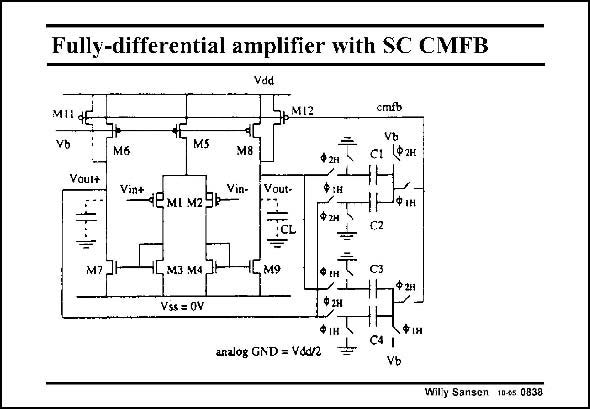

# SANSEN-0838 · Fully-differential amplifier with SC CMFB

章节：08 全差分放大器  
PDF 页：251；书本页：257；幻灯片编号：0838  
状态：unreviewed



## 对应教材讲解

### PDF 251 · 书本 257

When a clock is available, as in all sampleddata circuitry, it can be used towards a low-power CMFB loop. This amplifier is just a symmetrical OTA. The outputs are measured by a number of switches and capacitors, which provide common-mode feedback to the gates of transistors M11/M12. This feedback is not applied directly to the Gates of M8/M6 to make sure that not all current can be switched in the output devices. For common-mode disturbance in the supply lines or substrate, large transients at the outputs can be avoided in this way. In order to see how this circuit works, it is copied when all transistors are on, driven by clock W , and then when all transistors are on, driven by clock W . 1 2

## 公式／性能结论候选摘录

以下为规则截取的原文，尚未逐项判读。

（未由规则找到；不代表原页没有此类内容。）

## 曲线结论候选摘录

以下为规则截取的原文，尚未逐项判读。

（未由规则找到；不代表原页没有此类内容。）

## 原文条件与近似候选摘录

以下为规则截取的原文，尚未逐项判读。

（未由规则找到；不代表原页没有此类内容。）

## 幻灯片 OCR（未校正）

```text
Fully-differential amplifier with SC CMFB
Vdd
MIdE
Vb
JрM13
Voul+
M5
Mб
M8
V* «ЕмI м29k~
Vin-
Vout-
cmfb
Ф2н
T сі (фжн
Ф:н
-NфIн
C2
M7 Jl
=
-Lм9
M3 M4 Jt
Vss= OV
C3
Ф 2н
analog GND = Vdd/2
ФIН
=
ФІН
C4
Vb
Wily Sansen 10-4s 0839
```

数学上下标、分数及正负号以原图为准。电路图已保留；未核对的连接不输出成可仿真 netlist。
