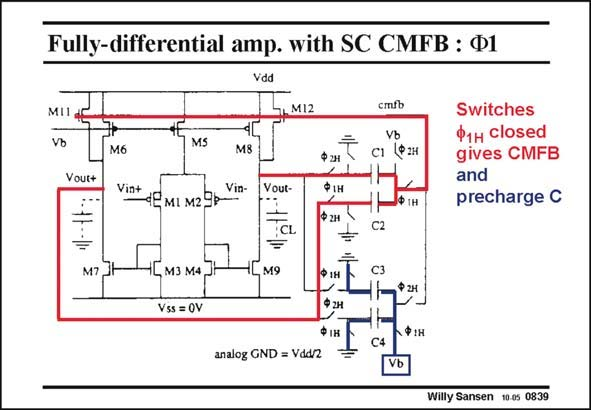

# SANSEN-0839 · Fully-differential amp. with SC CMFB : Ф1

章节：08 全差分放大器  
PDF 页：252；书本页：258；幻灯片编号：0839  
状态：unreviewed



## 对应教材讲解

### PDF 252 · 书本 258

This is exactly the same circuit as before. In this slide, clock W is 1 high, all the transistors, which are driven by this clock, are on. The other ones are off. Thick lines indicate which paths the signals can take. Clearly, the outputs are AC coupled by capacitors C1/C2. Their differential content is then cancelled out. Finally, this signal is then applied to the Gate of transistor M12 to close the feedback loop. The GBW is set by g and the output load capacitor. CM m12 The DC level at the Gate of M12 is not defined because of the coupling capacitances C1/C2. This is why the other two capacitances C3/C4 are precharged to the proper DC voltages. Their left side is set to analog ground (Vdd/2), whereas their right side is set at a biasing voltage, which is the same as at the Gates of current mirror transistors M5/M6/M8. On the next phase, the capacitors are swapped around, as shown in the next slide. Continuous CMFB is thus ensured.

## 公式／性能结论候选摘录

以下为规则截取的原文，尚未逐项判读。

- PDF 252: Continuous CMFB is thus ensured.

## 曲线结论候选摘录

以下为规则截取的原文，尚未逐项判读。

- PDF 252: On the next phase, the capacitors are swapped around, as shown in the next slide.

## 原文条件与近似候选摘录

以下为规则截取的原文，尚未逐项判读。

（未由规则找到；不代表原页没有此类内容。）

## 幻灯片 OCR（未校正）

```text
Fully-differential amp. with SC CMFB : Ф1
Vdd
MI
M12
MS
cmib
C1
Vb
P 2н
Vout+
M6
Vin+
Vin-
4Е мL м29р
Vout-
Ф 2н
ФІн
Ф гн
Ф1H
Switches
Ф1н closed
gives CMFB
and
precharge C
M7
CL
=
M9
C2
M3 M4
Vss =OV
PIн
$ 2н
•
IH
CЗ
Ф 2H
Ф:н
C4
analog GND = Vdd/2
Willy Sansen 10.05 0839
```

数学上下标、分数及正负号以原图为准。电路图已保留；未核对的连接不输出成可仿真 netlist。
