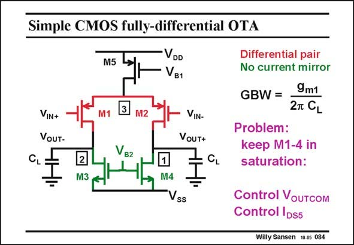

# SANSEN-084 · Simple CMOS fully-differential OTA

章节：08 全差分放大器  
PDF 页：234；书本页：240；幻灯片编号：084  
状态：unreviewed



## 对应教材讲解

### PDF 234 · 书本 240

The biasing voltages V B1 and V have to be such that B2 all transistors are in the saturation region. Otherwise they would exhibit a small output resistance which would deteriorate the gain. The problem of the two biasing voltages is that they have to be matched to such a degree that the average output voltages are somewhere halfway between the supply voltages, to keep all transistors in saturation, even for a large output swing. For example, if V is fixed, then a value of V , which is 20 mV too high would reduce both B1 B2 output voltages by 1 V (if the gain of the nMOSTs is 50). Even worse, when the V is larger, B2 the average output voltages are so low that the nMOSTs M3/M4 end up in the linear region, killing the gain! We have the same problem when biasing voltage V is too low. Now the average output B2 voltages are too high and the pMOSTs M1/M2 end up in the linear region, killing the gain as well! This kind of matching is impossible to realize. This is why we need an additional amplifier to tune V to the required average or common-mode output voltages. This amplifier only works B2 on common-mode signals. It is called the common-mode feedback amplifier.

## 公式／性能结论候选摘录

以下为规则截取的原文，尚未逐项判读。

- PDF 234: Otherwise they would exhibit a small output resistance which would deteriorate the gain.
- PDF 234: For example, if V is fixed, then a value of V , which is 20 mV too high would reduce both B1 B2 output voltages by 1 V (if the gain of the nMOSTs is 50).
- PDF 234: Even worse, when the V is larger, B2 the average output voltages are so low that the nMOSTs M3/M4 end up in the linear region, killing the gain!
- PDF 234: Now the average output B2 voltages are too high and the pMOSTs M1/M2 end up in the linear region, killing the gain as well!

## 曲线结论候选摘录

以下为规则截取的原文，尚未逐项判读。

（未由规则找到；不代表原页没有此类内容。）

## 原文条件与近似候选摘录

以下为规则截取的原文，尚未逐项判读。

- PDF 234: The biasing voltages V B1 and V have to be such that B2 all transistors are in the saturation region.
- PDF 234: The problem of the two biasing voltages is that they have to be matched to such a degree that the average output voltages are somewhere halfway between the supply voltages, to keep all transistors in saturation, even for a large output swing.

## 幻灯片 OCR（未校正）

```text
Simple CMOS fully-differential OTA
M5
VDD
VB1
3
VIN+
VoUT-
M2
VIN-
VoUT+
Vв2
2
M3
M4
Vss
Differential pair
No current mirror
GBW =
9m1
2T CL
Problem:
keep M1-4 in
saturation:
Control Voutcom
Control IDss
Willy Sansen 10-0s 084
```

数学上下标、分数及正负号以原图为准。电路图已保留；未核对的连接不输出成可仿真 netlist。
