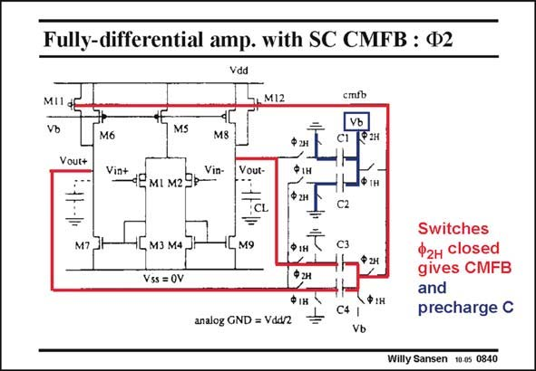

# SANSEN-0840 · Fully-differential amp. with SC CMFB : Ф2

章节：08 全差分放大器  
PDF 页：252；书本页：258；幻灯片编号：0840  
状态：unreviewed



## 对应教材讲解

### PDF 252 · 书本 258

In the phase W , the other 2 transistors are on. Capacitors C3/C4 now provide common-mode feedback, whereas the other ones C1/C2 are reset or precharged. It is clear that this solution does not take any power at all except for the switching power consumption of all switches and capacitors. However, there are a few disadvantages. First of all, the clock frequency appears in the signal path. This is a result of clock injection and charge redistribution, which are typical for all sampled-data circuits such as switched-capacitor filters. This is explained in detail in Chapter 17.

### PDF 253 · 书本 259

As a result, we can only use this solution at frequencies well below the clock frequency. Moreover, these clock injection and charge redistribution signals severely limit the dynamic range. Intermodulation (and folding) of these signals provide an upper limit to the signal-tonoise ratio. Finally, the switched capacitors increase the capacitive load of the CMFB amplifier. As a result, the GBW will be reduced and the common-mode settling time increased. CM

## 公式／性能结论候选摘录

以下为规则截取的原文，尚未逐项判读。

- PDF 253: As a result, we can only use this solution at frequencies well below the clock frequency.
- PDF 253: Moreover, these clock injection and charge redistribution signals severely limit the dynamic range.
- PDF 253: Intermodulation (and folding) of these signals provide an upper limit to the signal-tonoise ratio.
- PDF 253: Finally, the switched capacitors increase the capacitive load of the CMFB amplifier.
- PDF 253: As a result, the GBW will be reduced and the common-mode settling time increased.

## 曲线结论候选摘录

以下为规则截取的原文，尚未逐项判读。

- PDF 252: In the phase W , the other 2 transistors are on.

## 原文条件与近似候选摘录

以下为规则截取的原文，尚未逐项判读。

（未由规则找到；不代表原页没有此类内容。）

## 幻灯片 OCR（未校正）

```text
Fully-differential amp. with SC CMFB : Ф2
Vdd
MII
L MI2
MS
cmib
el
VЬ
(Ран
Vout+
M6
Vin+
Vin-
4ЕмI мг9р
Vout-
M7
CL
=
M9
$ 2н
ФІн
Ф гн
1H
M3 M4
Vss = OV
CЗ
₽ 2н
9 2н
ФIн \
analog GND = Vdd/2
=
\Ф1н
C4 |
Vb
Switches
Ф2н closed
gives CMFB
and
precharge C
Willy Sansen 10 0s 0840
```

数学上下标、分数及正负号以原图为准。电路图已保留；未核对的连接不输出成可仿真 netlist。
