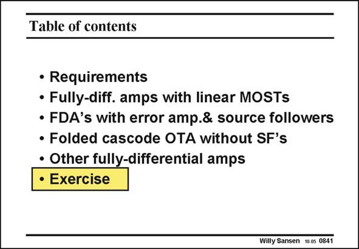

# SANSEN-0841 · Table of contents

章节：08 全差分放大器  
PDF 页：253；书本页：259；幻灯片编号：0841  
状态：unreviewed



## 对应教材讲解

### PDF 253 · 书本 259

Now that most types of CMFB amplifiers have been presented, this is a good opportunity to launch a design exercise. Only the design task is described. The solution can be obtained from the editor, in the exercise solution book.

## 公式／性能结论候选摘录

以下为规则截取的原文，尚未逐项判读。

（未由规则找到；不代表原页没有此类内容。）

## 曲线结论候选摘录

以下为规则截取的原文，尚未逐项判读。

（未由规则找到；不代表原页没有此类内容。）

## 原文条件与近似候选摘录

以下为规则截取的原文，尚未逐项判读。

（未由规则找到；不代表原页没有此类内容。）

## 幻灯片 OCR（未校正）

```text
Table of contents
• Requirements
• Fully-diff. amps with linear MOSTs
• FDA's with error amp.& source followers
• Folded cascode OTA without SF's
• Other fully-differential amps
• Exercise
Willy Sansen 10 0s 0841
```

数学上下标、分数及正负号以原图为准。电路图已保留；未核对的连接不输出成可仿真 netlist。
