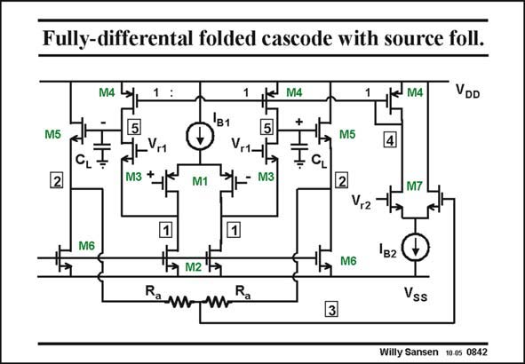

# SANSEN-0842 · Fully-differental folded cascode with source foll.

章节：08 全差分放大器  
PDF 页：253；书本页：259；幻灯片编号：0842  
状态：unreviewed



## 对应教材讲解

### PDF 253 · 书本 259

This fully-differential amplifier is of type 2. It is a folded cascode. It has both source followers and an error amplifier for the common-mode feedback. The outputs are evidently at nodes 5 or 2. The circuit has been simplified somewhat. For example, the current mirror transistors M4 have all the same size. Moreover, the CMFB resistors R are used a without the parallel capacitors C . They can be added a afterwards.

## 公式／性能结论候选摘录

以下为规则截取的原文，尚未逐项判读。

（未由规则找到；不代表原页没有此类内容。）

## 曲线结论候选摘录

以下为规则截取的原文，尚未逐项判读。

（未由规则找到；不代表原页没有此类内容。）

## 原文条件与近似候选摘录

以下为规则截取的原文，尚未逐项判读。

（未由规则找到；不代表原页没有此类内容。）

## 幻灯片 OCR（未校正）

```text
Fully-differental folded cascode with source foll.
M4
M5
'B1
M4
+
M4
VDD
M5
4
2
CL-
÷
<
г1
M3 +
CL
M1
M3
M7
V,2
M6
1в2
M6
R
Vss
3
Willy Sansen 10.0s 0842
```

数学上下标、分数及正负号以原图为准。电路图已保留；未核对的连接不输出成可仿真 netlist。
