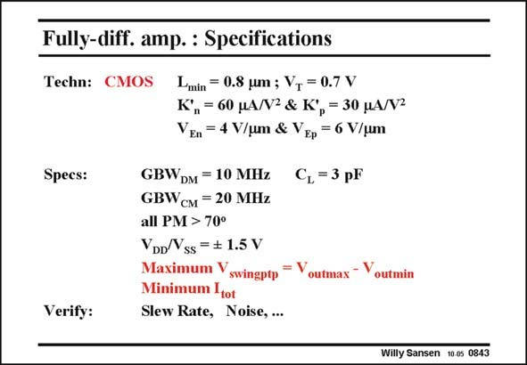

# SANSEN-0843 · Fully-diff. amp. : Specifications

章节：08 全差分放大器  
PDF 页：254；书本页：260；幻灯片编号：0843  
状态：unreviewed



## 对应教材讲解

### PDF 254 · 书本 260

The specifications to which this amplifier has to be designed, are given in this slide. The GBW’s are quite moderate, but so is the technology. Note that the GBW is CM a factor of two larger than the GBW . DM Note also that the total supply voltage is only 3 V. This is why we want to maximize the output swing. Obviously we always take minimum currents. For these specifications, only one possible design results. Only one set of currents and transistor sizes emerges. All other specifications such as Slew Rate, noise density, etc., can be verified afterwards.

## 公式／性能结论候选摘录

以下为规则截取的原文，尚未逐项判读。

（未由规则找到；不代表原页没有此类内容。）

## 曲线结论候选摘录

以下为规则截取的原文，尚未逐项判读。

（未由规则找到；不代表原页没有此类内容。）

## 原文条件与近似候选摘录

以下为规则截取的原文，尚未逐项判读。

（未由规则找到；不代表原页没有此类内容。）

## 幻灯片 OCR（未校正）

```text
Fully-diff. amp. : Specifications
Techn: CMOS
Specs:
Verify:
Lmin
= 0.8 um ; V, = 0.7 V
K°,= 60 HA/N2 & K°, = 30 MA/V2
VEn = 4 V/um &: VEp = 6 V/um
GBWDM = 10 MHz C, =3 pF
GBWсM = 20 MHz
all PM > 70°
VDD/Vss =$ 1.5 V
Maximum Yswingptp
,= Voutmax - Voutmin
Minimum Itot
Slew Rate, Noise, ...
Willy Sansen 10.0s 0843
```

数学上下标、分数及正负号以原图为准。电路图已保留；未核对的连接不输出成可仿真 netlist。
