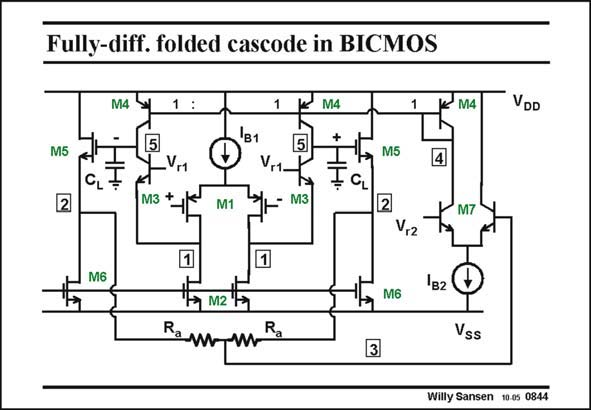

# SANSEN-0844 · Fully-diff. folded cascode in BICMOS

章节：08 全差分放大器  
PDF 页：254；书本页：260；幻灯片编号：0844  
状态：unreviewed



## 对应教材讲解

### PDF 254 · 书本 260

A BiCMOS equivalent is shown in this slide. The CMFB amplifier is the highest-speed circuit block. This is why it is realized by means of npn transistors. Also the current mirrors M4 are realized with pnp transistors. They only need a V of 0.1 V CE compared with a V of DS 0.2 V for MOSTs. We gain 0.1 V in output swing.

## 公式／性能结论候选摘录

以下为规则截取的原文，尚未逐项判读。

- PDF 254: We gain 0.1 V in output swing.

## 曲线结论候选摘录

以下为规则截取的原文，尚未逐项判读。

（未由规则找到；不代表原页没有此类内容。）

## 原文条件与近似候选摘录

以下为规则截取的原文，尚未逐项判读。

（未由规则找到；不代表原页没有此类内容。）

## 幻灯片 OCR（未校正）

```text
Fully-diff. folded cascode in BICMOS
M4
1
M4
M4
VDD
5
M5
B1
V.1
2
M3 +
M1
5
M3
M5
4
CL
M7
V,2
M6
1в2
M6
R
Vss
3
Willy Sansen 10-0s 0844
```

数学上下标、分数及正负号以原图为准。电路图已保留；未核对的连接不输出成可仿真 netlist。
