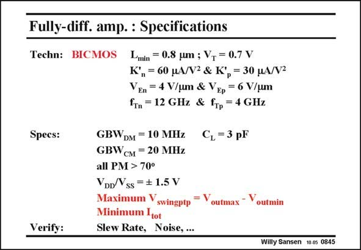

# SANSEN-0845 · Fully-diff. amp. : Specifications

章节：08 全差分放大器  
PDF 页：255；书本页：261；幻灯片编号：0845  
状态：unreviewed



## 对应教材讲解

### PDF 255 · 书本 261

The specifications to which this amplifier has to be designed are the same. Again, the total supply voltage is 3 V. We want to maximize again the output swing. All currents have to be minimized. Only one possible design emerges. The other specifications such as Slew Rate, noise density, etc., are then verified for comparison. As a hint for this design, the following steps have to be taken. The maximum output swing is the difference between the largest voltage at the output and the smallest one. This determines the output swing, but also the average output voltage. This leads to the upper value of the reference voltage V and the value of V . r1 r2 From the values of the GBW, the g can easily be derived. Choices for V −V and L lead m GS T to values of the current and the transistor size. In this way, all currents are known, except for the currents in the source followers M5. These currents, through transistors M5 determine the swing across resistors R , which has a been derived before. The resistors R determine on their turn, the non-dominant poles. a

## 公式／性能结论候选摘录

以下为规则截取的原文，尚未逐项判读。

（未由规则找到；不代表原页没有此类内容。）

## 曲线结论候选摘录

以下为规则截取的原文，尚未逐项判读。

（未由规则找到；不代表原页没有此类内容。）

## 原文条件与近似候选摘录

以下为规则截取的原文，尚未逐项判读。

（未由规则找到；不代表原页没有此类内容。）

## 幻灯片 OCR（未校正）

```text
Fully-diff. amp. : Specifications
Techn: BICMOS
Lmin = 0.8 um ; V, = 0.7 V
K°"= 60 HA/V2 & K°p = 30 MA/V2
VEn = 4 V/um & VEp = 6 V/um
fn = 12 GHz & Gp = 4 GHz
Specs:
Verify:
GBWDM = 10 MHz
GBWсM = 20 MHz
C,=3 pF
all PM > 70°
YDD/Vss = # 1.5 V
Maximum V
= V
swingptp
outmax - Voutmin
Minimum Itot
Slew Rate, Noise, ...
Willy Sansen 10.0s 0845
```

数学上下标、分数及正负号以原图为准。电路图已保留；未核对的连接不输出成可仿真 netlist。
