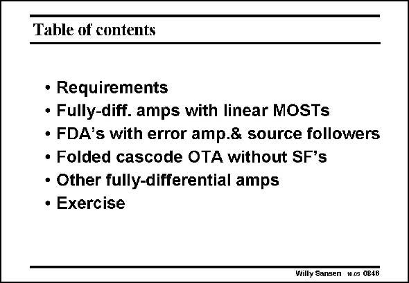

# SANSEN-0846 · Table of contents

章节：08 全差分放大器  
PDF 页：255；书本页：261；幻灯片编号：0846  
状态：unreviewed



## 对应教材讲解

### PDF 255 · 书本 261

In this Chapter fullydifferential amplifiers have been discussed in great detail. Design procedures have been discussed for all CMFB amplifiers. Finally an exercise is launched to test the comprehension of the reader.

## 公式／性能结论候选摘录

以下为规则截取的原文，尚未逐项判读。

（未由规则找到；不代表原页没有此类内容。）

## 曲线结论候选摘录

以下为规则截取的原文，尚未逐项判读。

（未由规则找到；不代表原页没有此类内容。）

## 原文条件与近似候选摘录

以下为规则截取的原文，尚未逐项判读。

（未由规则找到；不代表原页没有此类内容。）

## 幻灯片 OCR（未校正）

```text
Table of contents
• Requirements
• Fully-diff. amps with linear MOSTs
• FDA's with error amp.& source followers
• Folded cascode OTA without SF's
• Other fully-differential amps
• Exercise
Willy Sansen 10.05 084B
```

数学上下标、分数及正负号以原图为准。电路图已保留；未核对的连接不输出成可仿真 netlist。
