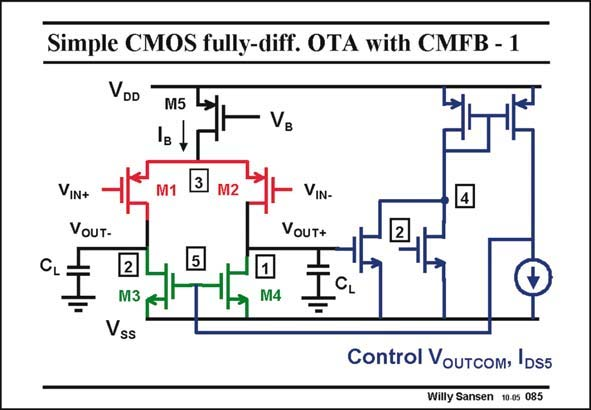

# SANSEN-085 · Simple CMOS fully-diff. OTA with CMFB - 1

章节：08 全差分放大器  
PDF 页：235；书本页：241；幻灯片编号：085  
状态：unreviewed



## 对应教材讲解

### PDF 235 · 书本 241

One example of such a CMFB amplifier is shown in this slide. Both output voltages are measured. Since we only want feedback on the common-mode signals, we have to cancel out the differential signals. This is done at node 4. Now we have to close the loop with an amplifier, and feed it to a common-mode point. Any biasing point in the circuit can be used for that. For this amplifier it is node 5. Clearly, part of the circuit belongs to both the common-mode and the differential amplifier. For example, transistors M3 and M4 are DC current sources for the differential signals, but single-transistor amplifiers for the common-mode signals. Also, the CMFB amplifier is always connected in unity-gain feedback. Nodes 1 and 2 are at the same time the input and output of the CMFB amplifier. It may thus require more power to ensure stability. The differential amplifier is evidently shown without feedback. Biasing voltage V is the independent biasing voltage. This could well have been the Gates of B the NMOSTs M3/M4, as shown next.

## 公式／性能结论候选摘录

以下为规则截取的原文，尚未逐项判读。

- PDF 235: Also, the CMFB amplifier is always connected in unity-gain feedback.
- PDF 235: It may thus require more power to ensure stability.
- PDF 235: Biasing voltage V is the independent biasing voltage.

## 曲线结论候选摘录

以下为规则截取的原文，尚未逐项判读。

（未由规则找到；不代表原页没有此类内容。）

## 原文条件与近似候选摘录

以下为规则截取的原文，尚未逐项判读。

（未由规则找到；不代表原页没有此类内容。）

## 幻灯片 OCR（未校正）

```text
Simple CMOS fully-diff. OTA with CMFB - 1
VDD
M5
Iв
B
VIN+
VoUT-
VIN-
Vouт+
CL
2
M3 .
Vss
M4
Control VouTcom› IDS5
Willy Sansen 10.05 085
```

数学上下标、分数及正负号以原图为准。电路图已保留；未核对的连接不输出成可仿真 netlist。
