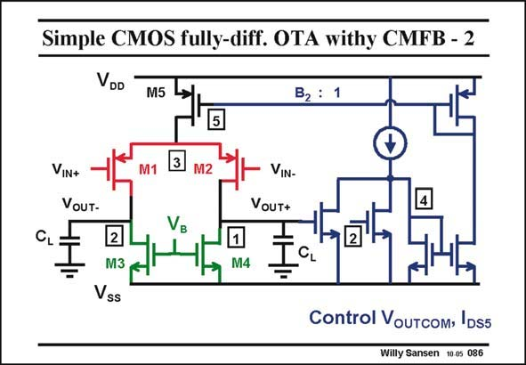

# SANSEN-086 · Simple CMOS fully-diff. OTA withy CMFB - 2

章节：08 全差分放大器  
PDF 页：235；书本页：241；幻灯片编号：086  
状态：unreviewed



## 对应教材讲解

### PDF 235 · 书本 241

Another CMFB amplifier is shown here. It now closes the feedback loop to the top current source. This is indeed good! Again, the output voltages are measured. The differential signals are cancelled out and the CMFB loop is closed by means of an amplifier. Now transistors M1 and M2 are common to both amplifiers. They function as a (differential) amplifier for differential signals, but as cascodes for the common-mode signals. In order to gain somewhat more insight in this CMFB amplifier it is sketched separately in the next slide.

## 公式／性能结论候选摘录

以下为规则截取的原文，尚未逐项判读。

- PDF 235: In order to gain somewhat more insight in this CMFB amplifier it is sketched separately in the next slide.

## 曲线结论候选摘录

以下为规则截取的原文，尚未逐项判读。

（未由规则找到；不代表原页没有此类内容。）

## 原文条件与近似候选摘录

以下为规则截取的原文，尚未逐项判读。

（未由规则找到；不代表原页没有此类内容。）

## 幻灯片 OCR（未校正）

```text
Simple CMOS fully-diff. OTA withy CMFB - 2
VDD
M5
B2 : 1
VIN+
VoUT-
VIN-
VouT+
CL
2
M3
Vss
M4
Control VouTcom, IDS5
Willy Sansen 10.05 086
```

数学上下标、分数及正负号以原图为准。电路图已保留；未核对的连接不输出成可仿真 netlist。
