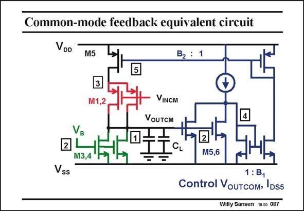

# SANSEN-087 · Common-mode feedback equivalent circuit

章节：08 全差分放大器  
PDF 页：236；书本页：242；幻灯片编号：087  
状态：unreviewed



## 对应教材讲解

### PDF 236 · 书本 242

The common-mode equivalent circuit is easily found by putting all differential devices in parallel and connecting them to the common-mode input signals. It is clear that node 1 is at the same time the input and the output of the CMFB amplifier. This is also the circuit that will be used, to derive the commonmode gain, bandwidth and GBW . CM Actually, the open-loop gain is B B g R , in 1 2 m5 n1 which B and B are the current gain factors of the two current mirrors. This gain is not so high 1 2 but only a small amount of gain is needed. The stabilization of the common-mode output voltage does not need to be so accurate. The outputs will both be at V above the negative supply. GS5,6 For large swing, we increase the size of these V ’s. GS The GBW will evidently be given by the B B g /(2pC ). We have two input transistors CM 1 2 m5 L M5 and M6 but also two load capacitors. The GBW can therefore be made quite high, at the CM cost of a lot of power consumption though!

## 公式／性能结论候选摘录

以下为规则截取的原文，尚未逐项判读。

- PDF 236: This is also the circuit that will be used, to derive the commonmode gain, bandwidth and GBW .
- PDF 236: CM Actually, the open-loop gain is B B g R , in 1 2 m5 n1 which B and B are the current gain factors of the two current mirrors.
- PDF 236: This gain is not so high 1 2 but only a small amount of gain is needed.
- PDF 236: GS5,6 For large swing, we increase the size of these V ’s.
- PDF 236: The GBW can therefore be made quite high, at the CM cost of a lot of power consumption though!

## 曲线结论候选摘录

以下为规则截取的原文，尚未逐项判读。

（未由规则找到；不代表原页没有此类内容。）

## 原文条件与近似候选摘录

以下为规则截取的原文，尚未逐项判读。

（未由规则找到；不代表原页没有此类内容。）

## 幻灯片 OCR（未校正）

```text
Common-mode feedback equivalent circuit
VDD
M5
B2 : 1
VINCM
VoUTcM
M3,4
M5,6
Vss
1: B,
Control VouTcom› IDS5
Willy Sansen 10.05 087
```

数学上下标、分数及正负号以原图为准。电路图已保留；未核对的连接不输出成可仿真 netlist。
