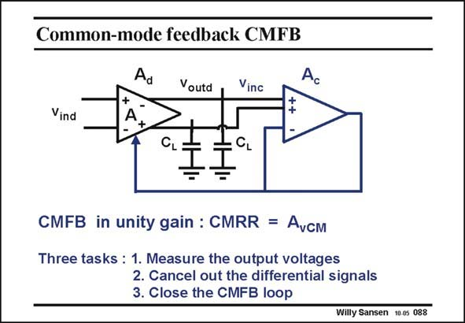

# SANSEN-088 · Common-mode feedback CMFB

章节：08 全差分放大器  
PDF 页：236；书本页：242；幻灯片编号：088  
状态：unreviewed



## 对应教材讲解

### PDF 236 · 书本 242

As a summary, let us repeat what the three tasks are of a CMFB amplifier. They have to measure the output voltages, cancel the differential signals and close the feedback loop. Also, the CMFB amplifier always operates in unitygain. Finally, it is important to note that the gain of the CMFB amplifier is used to increase the Common-mode rejection ratio (as shown in Chapter 15).

## 公式／性能结论候选摘录

以下为规则截取的原文，尚未逐项判读。

- PDF 236: Finally, it is important to note that the gain of the CMFB amplifier is used to increase the Common-mode rejection ratio (as shown in Chapter 15).

## 曲线结论候选摘录

以下为规则截取的原文，尚未逐项判读。

（未由规则找到；不代表原页没有此类内容。）

## 原文条件与近似候选摘录

以下为规则截取的原文，尚未逐项判读。

（未由规则找到；不代表原页没有此类内容。）

## 幻灯片 OCR（未校正）

```text
Common-mode feedback CMFB
Ad
Voutd
Vinc
Ac
Vind
+
A
+
CMFB in unity gain : CMRR = Avcm
Three tasks : 1. Measure the output voltages
2. Cancel out the differential signals
3. Close the CMFB loop
Willy Sansen 10.05 088
```

数学上下标、分数及正负号以原图为准。电路图已保留；未核对的连接不输出成可仿真 netlist。
