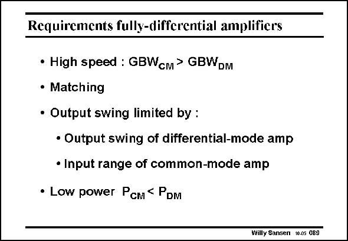

# SANSEN-089 · Requirements fully-differential amplifiers

章节：08 全差分放大器  
PDF 页：237；书本页：243；幻灯片编号：089  
状态：unreviewed



## 对应教材讲解

### PDF 237 · 书本 243

Let us now look at the main requirements of CMFB amplifiers.. The first one requires the common-mode GBW CM to be higher than the differential GBW . How- DM ever, this depends on the application. Indeed, if the commonmode amplifier were slow, only providing DC biasing, then a high-speed spike on the supply line or the substrate would throw the input devices or the active loads in the linear region. Slow common-mode feedback would then take too much time to restore the biasing in the input stage. During all this time, the high-speed differential amplifier would be out of operation. This why this specification comes first. In some specific circuits such as some sigma-delta converters, high speed amplifiers are only used in the low-frequency region. In this case this specification can be relaxed considerably! Requiring the GBW to be as large as the GBW will require a lot of power, directly CM DM conflicting with the last specification. We will see that there is no easy way of avoiding this compromise. In principle, a fully-differential amplifier simply doubles the power consumption. Finally, the output swing is also a problem. It is limited by both the output swing of the differential amplifier and by the common-mode input range of the CMFB amplifier (whichever is smaller).

## 公式／性能结论候选摘录

以下为规则截取的原文，尚未逐项判读。

- PDF 237: How- DM ever, this depends on the application.
- PDF 237: It is limited by both the output swing of the differential amplifier and by the common-mode input range of the CMFB amplifier (whichever is smaller).

## 曲线结论候选摘录

以下为规则截取的原文，尚未逐项判读。

（未由规则找到；不代表原页没有此类内容。）

## 原文条件与近似候选摘录

以下为规则截取的原文，尚未逐项判读。

（未由规则找到；不代表原页没有此类内容。）

## 幻灯片 OCR（未校正）

```text
Requirements fully-differential amplifiers
• High speed : GBWсm > GBWDM
• Matching
• Output swing limited by :
• Output swing of differential-mode amp
• Input range of common-mode amp
• Low power PcM< PDM
Willy Sansen 10.05 089
```

数学上下标、分数及正负号以原图为准。电路图已保留；未核对的连接不输出成可仿真 netlist。
