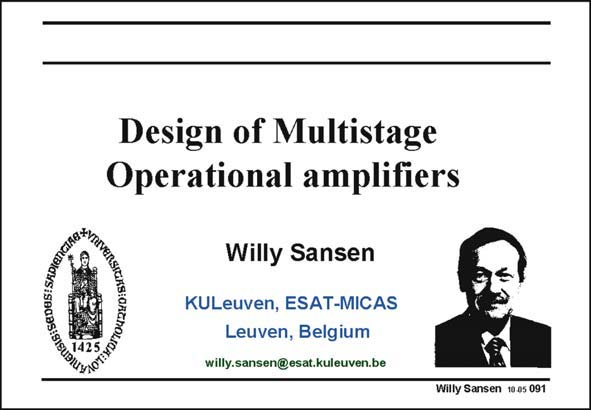

# SANSEN-091 · Slide 091

章节：09 多级运算放大器设计  
PDF 页：256；书本页：263；幻灯片编号：091  
状态：unreviewed



## 对应教材讲解

### PDF 256 · 书本 263

In many applications, operational amplifiers are required which have three stages. For example, class AB amplifiers have an output stage which provide little gain but a lot of current. The first two stages are now needed to provide gain. Also, when the supply voltage is less than 1 V, more stages are required as cascoding is no longer possible. In this Chapter, the principles are discussed to stabilize three-stage amplifiers. Moreover, circuit principles are devised to reduce the power consumption.

## 公式／性能结论候选摘录

以下为规则截取的原文，尚未逐项判读。

- PDF 256: For example, class AB amplifiers have an output stage which provide little gain but a lot of current.
- PDF 256: The first two stages are now needed to provide gain.

## 曲线结论候选摘录

以下为规则截取的原文，尚未逐项判读。

（未由规则找到；不代表原页没有此类内容。）

## 原文条件与近似候选摘录

以下为规则截取的原文，尚未逐项判读。

（未由规则找到；不代表原页没有此类内容。）

## 幻灯片 OCR（未校正）

```text
BIS:SEDUS:SADI0,
Design of Multistage
Operational amplifiers
Willy Sansen
KULeuven, ESAT-MICAS
Leuven, Belgium
willy.sansen@esat.kuleuven.be
Willy Sansen 10.a5 091
```

数学上下标、分数及正负号以原图为准。电路图已保留；未核对的连接不输出成可仿真 netlist。
