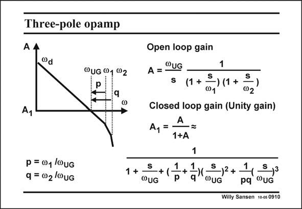

# SANSEN-0910 · Three-pole opamp

章节：09 多级运算放大器设计  
PDF 页：261；书本页：268；幻灯片编号：0910  
状态：unreviewed



## 对应教材讲解

### PDF 261 · 书本 268

The positions of the two non-dominant poles determine the open-loop response as sketched in this slide. How is the closed-loop response for unity gain? The expression of the open-loop gain A is approximated in this slide. The dominant pole at v is situd ated somewhere at low frequencies. We concentrate on the frequency region around the GBW. Therefore, v is d not visible. Moreover it is left out of the expressions forsimplification. The non-dominant poles are at (circle) frequencies v and v . The GBW occurs at unity gain 1 2 or at (circle) frequency v . The ratios of the non-dominant poles to the GBW are parameters UG p and q. Values of 3 and 5 have been used before for a phase margin of 60°. When the loop is closed towards unity gain, the expression of the gain A is now of third 1 order. Three poles occur quite close together, one at the GBW and two more at slightly higher frequencies What are the best values of p and q for a smooth response in closed-loop?

## 公式／性能结论候选摘录

以下为规则截取的原文，尚未逐项判读。

- PDF 261: How is the closed-loop response for unity gain?
- PDF 261: The expression of the open-loop gain A is approximated in this slide.
- PDF 261: Therefore, v is d not visible.
- PDF 261: The GBW occurs at unity gain 1 2 or at (circle) frequency v .
- PDF 261: When the loop is closed towards unity gain, the expression of the gain A is now of third 1 order.

## 曲线结论候选摘录

以下为规则截取的原文，尚未逐项判读。

- PDF 261: Values of 3 and 5 have been used before for a phase margin of 60°.

## 原文条件与近似候选摘录

以下为规则截取的原文，尚未逐项判读。

- PDF 261: The expression of the open-loop gain A is approximated in this slide.

## 幻灯片 OCR（未校正）

```text
Three-pole opamp
A 4
"d
"UG 01 Q2
Ay
Open loop gain
A = ®UG
1
s (1+ =) 11+ 02
Closed loop gain (Unity gain)
A, = A
1+A
1
p = w1/0uG
q = 02/WuG
1+ 3
-+ (
1
WUG
+
5,3
pq ®UG
Willy Sansen 10-05 0910
```

数学上下标、分数及正负号以原图为准。电路图已保留；未核对的连接不输出成可仿真 netlist。
