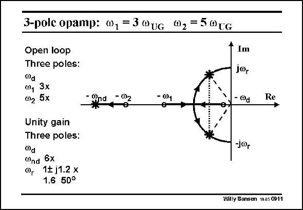

# SANSEN-0911 · 3-pole opamp: ", = 3 "uG 0, = 5@tc

章节：09 多级运算放大器设计  
PDF 页：261；书本页：268；幻灯片编号：0911  
状态：unreviewed



## 对应教材讲解

### PDF 261 · 书本 268

For values of p and q of 3 and 5, the situation is sketched in this slide in the complex plane (or polar diagram). In open loop, the dominant pole and two nondominant poles are all on the real axis. All poles are negative. A stable system thus results. When the loop is closed, the root locus shows where the poles end up. The two first poles v and v form d 1 complex poles, with resonant frequency at v , whereas the third one v moves to higher frequencies, to v at about 6 r 2 nd times the open-loop GBW. The complex poles have a resonant frequency v at about 1.6 times the open-loop GBW. They r

### PDF 262 · 书本 269

are complex with a real part about equal to the GBW and a real part of about 1.2 times the GBW. This shows clearly that even with real non-dominant poles in an open loop, complex poles usually result in a closed loop.

## 公式／性能结论候选摘录

以下为规则截取的原文，尚未逐项判读。

- PDF 261: A stable system thus results.
- PDF 262: are complex with a real part about equal to the GBW and a real part of about 1.2 times the GBW.

## 曲线结论候选摘录

以下为规则截取的原文，尚未逐项判读。

- PDF 261: In open loop, the dominant pole and two nondominant poles are all on the real axis.

## 原文条件与近似候选摘录

以下为规则截取的原文，尚未逐项判读。

（未由规则找到；不代表原页没有此类内容。）

## 幻灯片 OCR（未校正）

```text
3-pole opamp: ", = 3 "uG 0, = 5@tc
Open loop
Three poles:
®d
n, 3x
(n2 5x
- Rnd
Unity gain
Three poles:
00d
Wnd 6x
1+ j1.2 x
1.6 50°
- @1
* Im
10r
-@d
•)
Re
-j∞r
Willy Sansen 10.05 0911
```

数学上下标、分数及正负号以原图为准。电路图已保留；未核对的连接不输出成可仿真 netlist。
