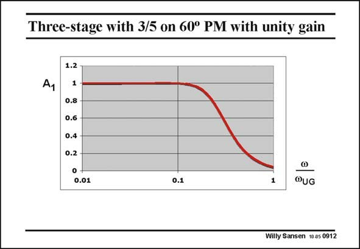

# SANSEN-0912 · Three-stage with 3/5 on 60° PM with unity gain

章节：09 多级运算放大器设计  
PDF 页：262；书本页：269；幻灯片编号：0912  
状态：unreviewed



## 对应教材讲解

### PDF 262 · 书本 269

A plot of the gain A1 in unity-gain is shown in this slide. It is merely the amplitude of the expression given in this slide. It is clear that a very flat response is obtained indeed. This is why this combination of non-dominant poles is chosen by many designers. They can go a bit further however, as shown next. Note also that only a fraction of the open-loop GBW is available in closed loop. The −3 dB point now occurs at about 0.3 times the GBW only.

## 公式／性能结论候选摘录

以下为规则截取的原文，尚未逐项判读。

- PDF 262: A plot of the gain A1 in unity-gain is shown in this slide.

## 曲线结论候选摘录

以下为规则截取的原文，尚未逐项判读。

- PDF 262: A plot of the gain A1 in unity-gain is shown in this slide.

## 原文条件与近似候选摘录

以下为规则截取的原文，尚未逐项判读。

（未由规则找到；不代表原页没有此类内容。）

## 幻灯片 OCR（未校正）

```text
Three-stage with 3/5 on 60° PM with unity gain
1.2
1
0.8 -
0.6
0.4
0.2
0.01
0.1
1
QUG
Willy Sansen 10 a5 0912
```

数学上下标、分数及正负号以原图为准。电路图已保留；未核对的连接不输出成可仿真 netlist。
