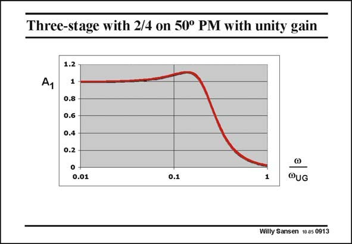

# SANSEN-0913 · Three-stage with 2/4 on 50° PM with unity gain

章节：09 多级运算放大器设计  
PDF 页：262；书本页：269；幻灯片编号：0913  
状态：unreviewed



## 对应教材讲解

### PDF 262 · 书本 269

Taking a lower phase margin of only 50°, with two non-dominant poles at 2 and 4 times the GBW yields a little bit of peaking. It is about 10% or 0.8 dB. However, the curve drops even faster. The −3 dB point is reached at about 0.24 times the open-loop GBW. The main advantage of this response is that the nondominant poles occur at lower frequencies, such that the power consumption may be lower. However, a little bit of peaking is the price to pay! We can still go a little bit further. We could allow complex poles already in open loop. The power consumption could then be less, as these poles are closer to the GBW than before. Obviously, we will find complex poles in the closed-loop response as well!

## 公式／性能结论候选摘录

以下为规则截取的原文，尚未逐项判读。

（未由规则找到；不代表原页没有此类内容。）

## 曲线结论候选摘录

以下为规则截取的原文，尚未逐项判读。

- PDF 262: Taking a lower phase margin of only 50°, with two non-dominant poles at 2 and 4 times the GBW yields a little bit of peaking.
- PDF 262: However, the curve drops even faster.
- PDF 262: However, a little bit of peaking is the price to pay!

## 原文条件与近似候选摘录

以下为规则截取的原文，尚未逐项判读。

（未由规则找到；不代表原页没有此类内容。）

## 幻灯片 OCR（未校正）

```text
Three-stage with 2/4 on 50° PM with unity gain
1.2
1
0.8 -
0.6
0.4
0.2
0.01
0.1
1
@UG
Willy Sansen 10as 0913
```

数学上下标、分数及正负号以原图为准。电路图已保留；未核对的连接不输出成可仿真 netlist。
