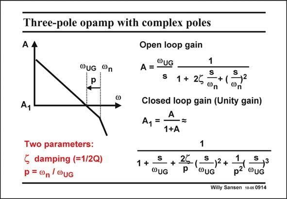

# SANSEN-0914 · Three-pole opamp with complex poles

章节：09 多级运算放大器设计  
PDF 页：263；书本页：270；幻灯片编号：0914  
状态：unreviewed



## 对应教材讲解

### PDF 263 · 书本 270

The expression is given for the open-loop gain of a three-pole opamp. Again the dominant pole is left out because it occurs at very low frequencies. However, the two nondominant poles are now complex. They are characterized by a resonant frequency v and by a n damping factor f (or Q= 1/2f). This resonant frequency is at a ratio p of the GBW. It is clear that we again have two parameters, this time not two real non-dominant poles but one pair of complex poles. The parameters are now not p and q but p and f. In a unity-gain closed loop, the expression of the gain A is easily obtained. It is obviously of 1 third order. The question now is, what is the best choice of the two parameters p and f to ensure a maximally flat response?

## 公式／性能结论候选摘录

以下为规则截取的原文，尚未逐项判读。

- PDF 263: The expression is given for the open-loop gain of a three-pole opamp.
- PDF 263: In a unity-gain closed loop, the expression of the gain A is easily obtained.

## 曲线结论候选摘录

以下为规则截取的原文，尚未逐项判读。

（未由规则找到；不代表原页没有此类内容。）

## 原文条件与近似候选摘录

以下为规则截取的原文，尚未逐项判读。

（未由规则找到；不代表原页没有此类内容。）

## 幻灯片 OCR（未校正）

```text
Three-pole opamp with complex poles
Ay
OUG "n
Open loop gain
A = °UG
s 1 + 25
1
S
)2
Фn
Closed loop gain (Unity gain)
A
A1 =
1+A
Two parameters:
§ damping (=1/2Q)
p = 0n/ @uG
S
1 +
+ 25
WUG
P
1
S
-)2+ -
S,3
QUG
p2 ouG
Willy Sansen 10-05 0914
```

数学上下标、分数及正负号以原图为准。电路图已保留；未核对的连接不输出成可仿真 netlist。
