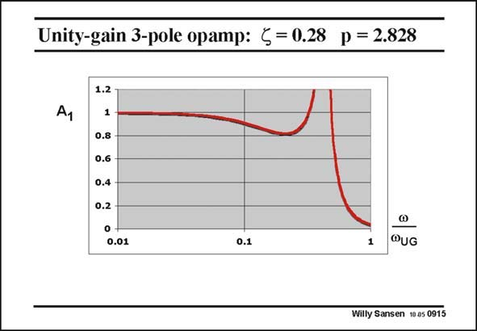

# SANSEN-0915 · Unity-gain 3-pole opamp: < = 0.28 p = 2.828

章节：09 多级运算放大器设计  
PDF 页：263；书本页：270；幻灯片编号：0915  
状态：unreviewed



## 对应教材讲解

### PDF 263 · 书本 270

In order to illustrate how these two parameters play towards the frequency response, several values of damping factor f are tried out for equal distance p of the resonant frequency to the GBW. Perhaps the chosen values of p and f seem to be a bit awkward. A few slides later, it will become clear why these have been selected. One thing is obvious. The damping is too low. A huge peak occurs, even beyond the vertical scale. As we have kept the same scale for all examples, the peak exceeds the scale. The damping must therefore be increased in order to flatten the response.

## 公式／性能结论候选摘录

以下为规则截取的原文，尚未逐项判读。

- PDF 263: In order to illustrate how these two parameters play towards the frequency response, several values of damping factor f are tried out for equal distance p of the resonant frequency to the GBW.
- PDF 263: The damping must therefore be increased in order to flatten the response.

## 曲线结论候选摘录

以下为规则截取的原文，尚未逐项判读。

- PDF 263: A huge peak occurs, even beyond the vertical scale.
- PDF 263: As we have kept the same scale for all examples, the peak exceeds the scale.

## 原文条件与近似候选摘录

以下为规则截取的原文，尚未逐项判读。

（未由规则找到；不代表原页没有此类内容。）

## 幻灯片 OCR（未校正）

```text
Unity-gain 3-pole opamp: < = 0.28 p = 2.828
Ay
1.2
1
0.8
0.6
0.4
0.2
0.01
0.1
1
@UG
Willy Sansen 10 a5 0915
```

数学上下标、分数及正负号以原图为准。电路图已保留；未核对的连接不输出成可仿真 netlist。
