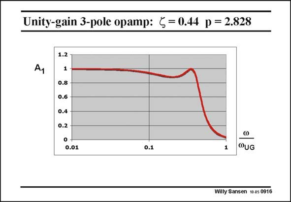

# SANSEN-0916 · Unity-gain 3-pole opamp: < = 0.44 p = 2.828

章节：09 多级运算放大器设计  
PDF 页：264；书本页：271；幻灯片编号：0916  
状态：unreviewed



## 对应教材讲解

### PDF 264 · 书本 271

Increasing the damping factor f reduces the peaking. At this value of f the peaking is about the same as the low-frequency value of the gain. There is a dip of about 10%, which could be acceptable depending on the application. Because of the peaking, the −3dB frequency (at a value of 0.707) is slightly larger. It occurs at about 0.43 times the open-loop GBW. Let us now increase the damping even more. Several values of f are now tried, until a very flat response is obtained. Thy are collected on the next slide.

## 公式／性能结论候选摘录

以下为规则截取的原文，尚未逐项判读。

- PDF 264: At this value of f the peaking is about the same as the low-frequency value of the gain.
- PDF 264: There is a dip of about 10%, which could be acceptable depending on the application.
- PDF 264: Let us now increase the damping even more.

## 曲线结论候选摘录

以下为规则截取的原文，尚未逐项判读。

- PDF 264: Increasing the damping factor f reduces the peaking.
- PDF 264: At this value of f the peaking is about the same as the low-frequency value of the gain.
- PDF 264: Because of the peaking, the −3dB frequency (at a value of 0.707) is slightly larger.

## 原文条件与近似候选摘录

以下为规则截取的原文，尚未逐项判读。

（未由规则找到；不代表原页没有此类内容。）

## 幻灯片 OCR（未校正）

```text
Unity-gain 3-pole opamp: < = 0.44 p = 2.828
Ay
1.2 T
1
0.8
0.6
0.4
0.2
0 +
0.01
0.1
1
@UG
Willy Sansen 10 a5 0916
```

数学上下标、分数及正负号以原图为准。电路图已保留；未核对的连接不输出成可仿真 netlist。
