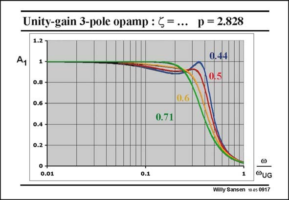

# SANSEN-0917 · Unity-gain 3-pole opamp : 5= ... p = 2.828

章节：09 多级运算放大器设计  
PDF 页：264；书本页：271；幻灯片编号：0917  
状态：unreviewed



## 对应教材讲解

### PDF 264 · 书本 271

The responses are sketched for different values of damping factors f. The one for f= 0.44 is repeated for reference. Values are taken of 0.5, 0.6 and finally of 0.71. It is clear that the curve for f=0.71 (actually 1/√2) a maximally flat response is obtained. This is the thirdorder Butterworth response. It occurs for a p factor of 2√2 and a f of 1/√2. In an open loop, the non-dominant poles are already complex. They are certainly complex in a closed loop. This positioning of non-dominant is quite popular with designers of three-stage amplifiers. The non-dominant poles are at relatively low frequencies. The power consumption is relatively small. It is now clear why a p factor of 2.828 has been chosen. It is exactly the p factor required for a third-order maximally flat Butterworth response. Finally, note that the maximally flat response leads to a −3 dB frequency, which is somewhat lower than before. It is now about 0.3 times the open-loop GBW.

## 公式／性能结论候选摘录

以下为规则截取的原文，尚未逐项判读。

（未由规则找到；不代表原页没有此类内容。）

## 曲线结论候选摘录

以下为规则截取的原文，尚未逐项判读。

- PDF 264: It is clear that the curve for f=0.71 (actually 1/√2) a maximally flat response is obtained.

## 原文条件与近似候选摘录

以下为规则截取的原文，尚未逐项判读。

（未由规则找到；不代表原页没有此类内容。）

## 幻灯片 OCR（未校正）

```text
Unity-gain 3-pole opamp : 5= ... p = 2.828
1.2
1 -
0.8 -
0.6 --
0.4 -
0.2 -
0+
0.01
0.6
0.71
0.1
0.44
0,5
@UG
Willy Sansen 10.a5 0917
```

数学上下标、分数及正负号以原图为准。电路图已保留；未核对的连接不输出成可仿真 netlist。
