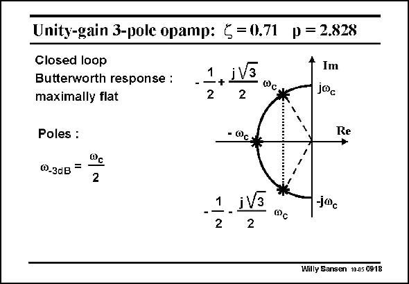

# SANSEN-0918 · p = 2.828 Unity-gain 3-pole opamp: 5=0.71

章节：09 多级运算放大器设计  
PDF 页：265；书本页：272；幻灯片编号：0918  
状态：unreviewed



## 对应教材讲解

### PDF 265 · 书本 272

The complex plane corresponding to this situation, is sketched in this slide. The poles are only shown in closed loop. All poles lie on a semicircle. The resulting −3 dB frequency is half this pole frequency v , which is obvic ously related to the openloop GBW. This response will now be used to compare several three-stage opamp configurations.

## 公式／性能结论候选摘录

以下为规则截取的原文，尚未逐项判读。

（未由规则找到；不代表原页没有此类内容。）

## 曲线结论候选摘录

以下为规则截取的原文，尚未逐项判读。

（未由规则找到；不代表原页没有此类内容。）

## 原文条件与近似候选摘录

以下为规则截取的原文，尚未逐项判读。

（未由规则找到；不代表原页没有此类内容。）

## 幻灯片 OCR（未校正）

```text
Unity-gain 3-pole opamp: 5=0.71
p = 2.828
Closed loop
Butterworth response :
maximally flat
Poles :
@_3dB
=
1
jV3
-+
2
2
Фc
- @cv
+
Im
juc
Re
2
1
•-•
iV3
2
2
j®c
Willy Sansen 10.05 0918
```

数学上下标、分数及正负号以原图为准。电路图已保留；未核对的连接不输出成可仿真 netlist。
