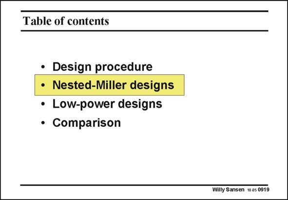

# SANSEN-0919 · Table of contents

章节：09 多级运算放大器设计  
PDF 页：265；书本页：272；幻灯片编号：0919  
状态：unreviewed



## 对应教材讲解

### PDF 265 · 书本 272

Now that we know how to stabilize a three-stage amplifier, that we know how to choose the two variables p and q, or even better p and f – we use this procedure to design such an amplifier. However, there are several configurations. We will start with the conventional Nested Miller Compensation (NMC) and then gradually add other branches such as feedforward, multi-path branches, etc.

## 公式／性能结论候选摘录

以下为规则截取的原文，尚未逐项判读。

（未由规则找到；不代表原页没有此类内容。）

## 曲线结论候选摘录

以下为规则截取的原文，尚未逐项判读。

（未由规则找到；不代表原页没有此类内容。）

## 原文条件与近似候选摘录

以下为规则截取的原文，尚未逐项判读。

（未由规则找到；不代表原页没有此类内容。）

## 幻灯片 OCR（未校正）

```text
Table of contents
• Design procedure
• Nested-Miller designs
• Low-power designs
• Comparison
Willy Sansen 10.a5 0919
```

数学上下标、分数及正负号以原图为准。电路图已保留；未核对的连接不输出成可仿真 netlist。
