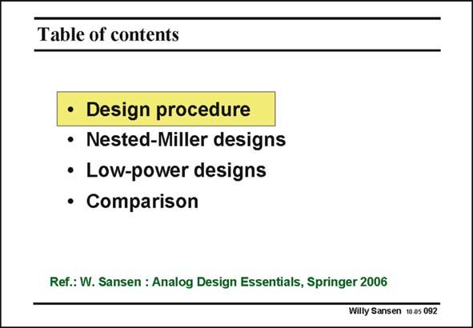

# SANSEN-092 · Table of contents

章节：09 多级运算放大器设计  
PDF 页：256；书本页：263；幻灯片编号：092  
状态：unreviewed



## 对应教材讲解

### PDF 256 · 书本 263

With three stages, stability is less obvious than two stages. This is why the first topic in this Chapter is devoted to stability requirements. A specific design procedure has to be followed to ensure stability with minimum power consumption. Nested-Miller designs are discussed next. They have been used for some time now. However, they suffer from excessive power consumption in the output stage. This is why several low-power designs are introduced and compared. They allow power savings of up to 40 times. They are therefore useful for low-power and portable systems.

## 公式／性能结论候选摘录

以下为规则截取的原文，尚未逐项判读。

- PDF 256: They are therefore useful for low-power and portable systems.

## 曲线结论候选摘录

以下为规则截取的原文，尚未逐项判读。

（未由规则找到；不代表原页没有此类内容。）

## 原文条件与近似候选摘录

以下为规则截取的原文，尚未逐项判读。

（未由规则找到；不代表原页没有此类内容。）

## 幻灯片 OCR（未校正）

```text
Table of contents
• Design procedure
• Nested-Miller designs
• Low-power designs
• Comparison
Ref.: W. Sansen : Analog Design Essentials, Springer 2006
Willy Sansen 10 a5 092
```

数学上下标、分数及正负号以原图为准。电路图已保留；未核对的连接不输出成可仿真 netlist。
