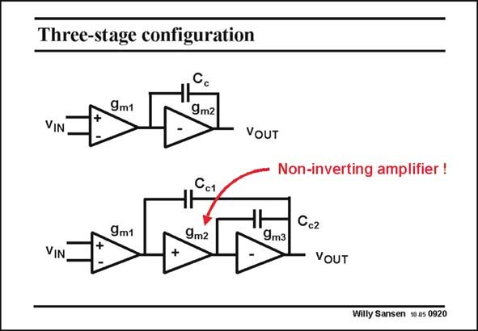

# SANSEN-0920 · Three-stage configuration

章节：09 多级运算放大器设计  
PDF 页：266；书本页：273；幻灯片编号：0920  
状态：unreviewed



## 对应教材讲解

### PDF 266 · 书本 273

When we focus on configurations, we have to make a decision first on which noninverting amplifier to use. Indeed, the second stage of a three-stage amplifier is normally single-ended, as the output stage is singleended as well. However, a single-transistor amplifier is always inverting. It cannot be used as a second-stage of a threestage amplifier. Otherwise compensation capacitance C would provide positive c1 feedback! It is clear that such a non-inverting amplifier is not required in a two-stage amplifier, only in a three-stage amplifier. There are two possible solutions. The original one is shown next.

## 公式／性能结论候选摘录

以下为规则截取的原文，尚未逐项判读。

（未由规则找到；不代表原页没有此类内容。）

## 曲线结论候选摘录

以下为规则截取的原文，尚未逐项判读。

（未由规则找到；不代表原页没有此类内容。）

## 原文条件与近似候选摘录

以下为规则截取的原文，尚未逐项判读。

（未由规则找到；不代表原页没有此类内容。）

## 幻灯片 OCR（未校正）

```text
Three-stage configuration
9m1
9m2
VIN
VOUT
Non-inverting amplifier!
Сс1
9m1
9m2
ЧH
9m3
Ccг
+
VIN
+
VOUT
Willy Sansen 10as 0920
```

数学上下标、分数及正负号以原图为准。电路图已保留；未核对的连接不输出成可仿真 netlist。
