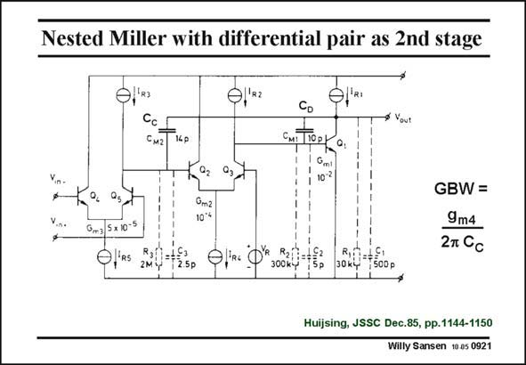

# SANSEN-0921 · Nested Miller with differential pair as 2nd stage

章节：09 多级运算放大器设计  
PDF 页：266；书本页：273；幻灯片编号：0921  
状态：unreviewed



## 对应教材讲解

### PDF 266 · 书本 273

In this three stage amplifier, which is fully realized in bipolar technology, a differential pair is used as a second stage. The output ‘‘on the other side’’ is noninverting indeed. The other functions of the three stages are easily recognized. The nested compensation capacitances are 14 pF and 10 pF respectively. The first one determines the GBW. An alternative is shown next.

## 公式／性能结论候选摘录

以下为规则截取的原文，尚未逐项判读。

（未由规则找到；不代表原页没有此类内容。）

## 曲线结论候选摘录

以下为规则截取的原文，尚未逐项判读。

（未由规则找到；不代表原页没有此类内容。）

## 原文条件与近似候选摘录

以下为规则截取的原文，尚未逐项判读。

（未由规则找到；不代表原页没有此类内容。）

## 幻灯片 OCR（未校正）

```text
Nested Miller with differential pair as 2nd stage
K4p
MI TOP,
Oml
10:2
Gm3 5 x 101
Gm2
10*%
GBW =
9m4
2T Cc
-R$
R3
2Mid
5p
30 ky
500 p
Huijsing, JSSC Dec.85, pp.1144-1150
Willy Sansen 10 as 0921
```

数学上下标、分数及正负号以原图为准。电路图已保留；未核对的连接不输出成可仿真 netlist。
