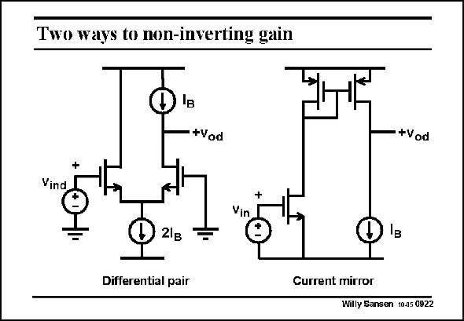

# SANSEN-0922 · Two ways to non-inverting gain

章节：09 多级运算放大器设计  
PDF 页：267；书本页：274；幻灯片编号：0922  
状态：unreviewed



## 对应教材讲解

### PDF 267 · 书本 274

After all, a current mirror iscapable of providing a non-inverting gain. Both a differential pair and a current mirror are elementary circuit blocks. If all transistors carry equal DC currents, then the power consumption is the same as well. Both are simple and can provide gain up to high frequencies. It is not clear which one to prefer! Perhaps the current mirror has a slight edge as it is the circuit block with the highest bandwidth. A comparative study will be carried out to be able to find out what the difference really is!

## 公式／性能结论候选摘录

以下为规则截取的原文，尚未逐项判读。

- PDF 267: After all, a current mirror iscapable of providing a non-inverting gain.
- PDF 267: If all transistors carry equal DC currents, then the power consumption is the same as well.
- PDF 267: Both are simple and can provide gain up to high frequencies.
- PDF 267: Perhaps the current mirror has a slight edge as it is the circuit block with the highest bandwidth.

## 曲线结论候选摘录

以下为规则截取的原文，尚未逐项判读。

（未由规则找到；不代表原页没有此类内容。）

## 原文条件与近似候选摘录

以下为规则截取的原文，尚未逐项判读。

（未由规则找到；不代表原页没有此类内容。）

## 幻灯片 OCR（未校正）

```text
Two ways to non-inverting gain
*Vod
-+Vod
+
Vind
Vin
21B
Differential pair
Current mirror
Willy Sansen 10.05 0922
```

数学上下标、分数及正负号以原图为准。电路图已保留；未核对的连接不输出成可仿真 netlist。
