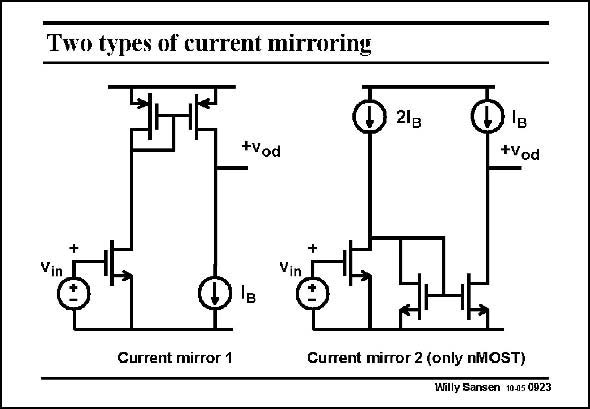

# SANSEN-0923 · Two types of current mirroring

章节：09 多级运算放大器设计  
PDF 页：267；书本页：274；幻灯片编号：0923  
状态：unreviewed



## 对应教材讲解

### PDF 267 · 书本 274

More sophisticated current mirrors can be used as well. In the second one, only nMOST devices are used. It most probably has a larger bandwidth than the first one. However, it consumes 50% more current! Would the increase in bandwidth be offset by the increase in power consumption? Probably, the difference between both is minor.

## 公式／性能结论候选摘录

以下为规则截取的原文，尚未逐项判读。

- PDF 267: It most probably has a larger bandwidth than the first one.
- PDF 267: Would the increase in bandwidth be offset by the increase in power consumption?

## 曲线结论候选摘录

以下为规则截取的原文，尚未逐项判读。

（未由规则找到；不代表原页没有此类内容。）

## 原文条件与近似候选摘录

以下为规则截取的原文，尚未逐项判读。

（未由规则找到；不代表原页没有此类内容。）

## 幻灯片 OCR（未校正）

```text
Two types of current mirroring
D
21B
+Vod
+Vod
Vi
Vin
Current mirror 1
Current mirror 2 (only nMOST)
Willy Sansen 10-05 0923
```

数学上下标、分数及正负号以原图为准。电路图已保留；未核对的连接不输出成可仿真 netlist。
